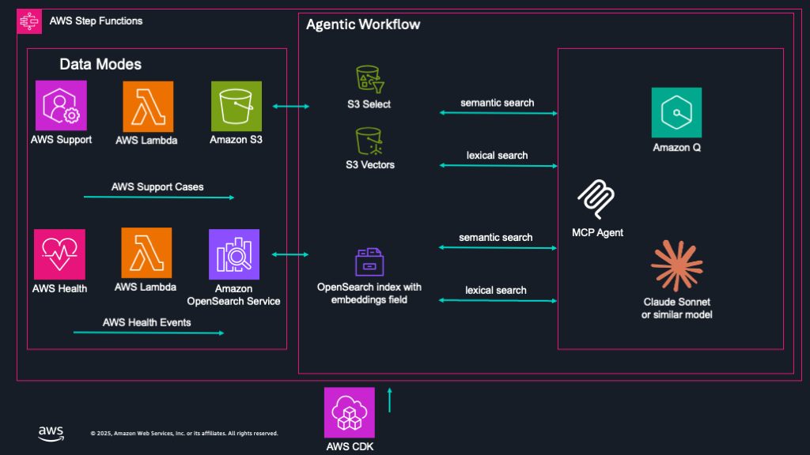

# MAKI Agent Guide

This guide shows how to use MAKI as a FastMCP agent with Amazon Q CLI for interactive support data analysis.

## Agentic Workflow


## Prerequisites

- AWS CLI configured with appropriate permissions
- Python 3.8 or later
- Node.js 18 or later (for Amazon Q CLI)

## Step 1: Install Amazon Q CLI

### macOS/Linux
```bash
curl -sSL https://amazon-q-developer-cli.s3.us-west-2.amazonaws.com/install.sh | bash
```

### Windows (PowerShell)
```powershell
iwr -Uri "https://amazon-q-developer-cli.s3.us-west-2.amazonaws.com/install.ps1" -OutFile "install.ps1"; .\install.ps1
```

### Verify Installation
```bash
q --version
```

## Step 2: Deploy MAKI Infrastructure

Deploy the MAKI backend infrastructure first:

```bash
# Clone and navigate to MAKI directory
cd /path/to/sample-support-data-analysis-with-bedrock

# Deploy main infrastructure (follow MAKI_USER_GUIDE.md for detailed steps)
cdk deploy

# Deploy the MakiAgents stack (required for MCP server functionality)
cdk deploy MakiAgents
```

## Step 3: Set Up MCP Server

### Install Dependencies
```bash
pip install fastmcp boto3 pandas
```

### Create MCP Server Configuration
Add the below entry in your `mcp.json` file. Ensure that the path to the `maki/BuildAgents.py` is correct.

```json
{
  "mcpServers": {
    "maki": {
      "command": "python",
      "args": ["maki/BuildAgents.py"],
      "env": {
        "AWS_REGION": "us-east-1"
      }
    }
  }
}
```

## Step 4: Configure Amazon Q CLI with MCP

```bash
# Initialize Q CLI with MCP configuration
q config set mcp-config-path ./mcp.json

# Start Q CLI
q chat 
```

## Example Queries

Once connected, you can use these example queries focused on AWS Health Events:

### Recent Health Events Analysis
```
Analyze AWS Health Events from the last 7 days and identify the most impactful service disruptions
```

### Service-Specific Health Events
```
What AWS Health Events have affected EC2 services in the last 30 days?
```

### Regional Health Event Analysis
```
Show me AWS Health Events in us-east-1 region for the past 14 days
```

### Health Event Impact Assessment
```
Analyze the customer impact of recent AWS Health Events related to S3 service outages
```

### Health Event Trends
```
Compare AWS Health Event frequency between this month and last month across all services
```

### Critical Health Events
```
Find all high-severity AWS Health Events in the last quarter and their resolution times
```

## Advanced Usage

### Custom Time Ranges for Health Events
```
Analyze AWS Health Events from 2024-01-01 to 2024-03-31 for Lambda service issues
```

### Multi-Service Health Event Analysis
```
Compare AWS Health Event patterns between S3, EC2, and RDS services over the last 60 days
```

### Health Event Executive Summary
```
Generate an executive summary of AWS Health Event trends and service reliability for the last month
```

## Troubleshooting

### MCP Server Not Starting
- Verify Python dependencies are installed
- Check AWS credentials are configured
- Ensure MAKI infrastructure and MakiAgents stack are deployed

### Connection Issues
- Verify `mcp.json` path is correct
- Check AWS region matches your deployment
- Confirm Lambda functions are accessible

### Query Errors
- Ensure AWS Health Event IDs are valid
- Check time range format (e.g., "7d", "30d", "2024-01-01")
- Verify you have permissions to access AWS Health data

## Next Steps

- Customize the MCP server for your specific use cases
- Add additional analysis functions
- Integrate with your existing AWS Health monitoring workflows
- Set up automated reporting using the Q CLI
