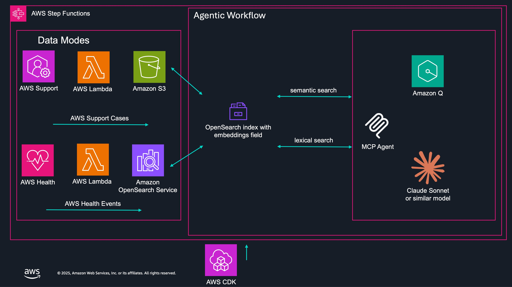

# MAKI — Machine Augmented Key Insights

MAKI is a sample application for educational purposes that processes AWS data with Amazon Bedrock to derive meaningful insights. It supports analysis of both AWS Enterprise Support cases and AWS Health events, providing automated categorization, sentiment analysis, and actionable recommendations.

## Architecture

### Reporting and Analysis

### Agentic Workflow

## Key Features

- **Dual Data Source Support** — Analyze AWS Enterprise Support cases or AWS Health events
- **Automated Categorization** — Classifies events into predefined categories using Amazon Bedrock
- **Sentiment Analysis** — Determines sentiment from event content
- **Actionable Insights** — Provides suggested actions and documentation links
- **Scalable Processing** — Uses both on-demand and batch inference based on volume
- **Agentic Workflow** — Interactive analysis via FastMCP agent with Amazon Q CLI

## Key Technologies

- **Amazon Bedrock** — LLM inference (light and sophisticated models)
- **Amazon S3** — Data storage and processing
- **AWS Lambda** — Serverless compute functions
- **AWS Step Functions** — Workflow orchestration with mode-based routing
- **Amazon CloudWatch** — Logging and monitoring
- **OpenSearch Serverless** — Health events storage and search
- **AWS Systems Manager** — Parameter Store for mode configuration
- **AWS CDK** — Infrastructure-as-code

## Documentation

- **[MAKI User Guide](MAKI_USER_GUIDE.md)** — Complete guide for deploying and using MAKI
- **[MAKI Agent Guide](MAKI_AGENT_GUIDE.md)** — Guide for using the MAKI FastMCP agent with Amazon Q CLI

## Getting Started

See the [MAKI User Guide](MAKI_USER_GUIDE.md) for prerequisites, installation, configuration, and deployment instructions.
