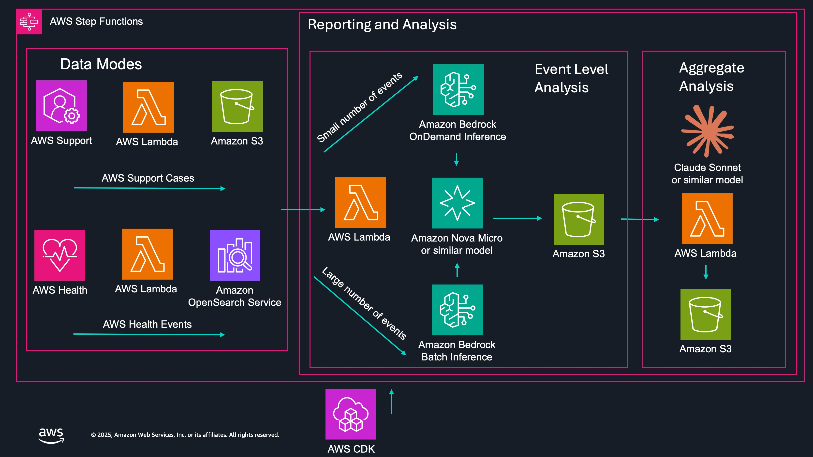

# MAKI User Guide
## Machine Augmented Key Insights for AWS Enterprise Support Data Analysis

### Table of Contents
1. [Overview](#overview)
2. [Prerequisites](#prerequisites)
3. [Installation & Setup](#installation--setup)
4. [Getting Started](#getting-started)
5. [Configuration](#configuration)
6. [Deployment](#deployment)
7. [Data Sources](#data-sources)
8. [Output & Analysis](#output--analysis)
9. [Troubleshooting](#troubleshooting)
10. [Advanced Features](#advanced-features)

---

This document illustrates how to deploy MAKI and how to use it for Reporting and Analysis.
For Agentic usage, refer to the **[MAKI Agent Guide](MAKI_AGENT_GUIDE.md)**. 

## Reporting and Analysis



## Overview

MAKI (Machine Augmented Key Insights) is an educational sample application that demonstrates how Amazon Bedrock can analyze AWS data to derive meaningful insights. It supports two data source modes:

1. **Support Cases Mode**: Analyzes AWS Enterprise Support cases
2. **Health Events Mode**: Analyzes AWS Health events

### Key Features
- **Dual Data Source Support**: Process either support cases or health events
- **Automated Analysis**: Categorizes events into predefined categories
- **Sentiment Analysis**: Determines sentiment from event content
- **Actionable Insights**: Provides suggested actions and documentation links
- **Scalable Processing**: Uses both on-demand and batch inference based on volume
- **Comprehensive Reporting**: Generates detailed JSON reports for further analysis
- **Mode Switching**: Easy switching between data source modes

### Architecture Components
- **Amazon Bedrock**: LLM inference (light and sophisticated models)
- **Amazon S3**: Data storage and processing
- **AWS Lambda**: Serverless compute functions
- **AWS Step Functions**: Workflow orchestration with mode-based routing
- **Amazon CloudWatch**: Logging and monitoring
- **OpenSearch Serverless**: Health events storage and search (Health mode only)
- **AWS Systems Manager**: Parameter Store for mode configuration

---

## Prerequisites

### AWS Services Required
- AWS Enterprise Support (for real support case data)
- Amazon Bedrock with enabled models
- AWS Cloud Intelligence Dashboard (CID) - optional but recommended

### Development Environment
- Python 3.9+
- AWS CDK v2
- AWS CLI configured with appropriate permissions
- Node.js (for CDK)

### Required Permissions
- Bedrock model access and inference permissions
- S3 bucket creation and management
- Lambda function deployment
- Step Functions execution
- CloudWatch logging
- Systems Manager Parameter Store access
- OpenSearch Serverless access (for Health mode)
- AWS Health API access (for Health mode)

---

## Installation & Setup

### Prerequisites Installation

Before setting up MAKI, ensure all required components are installed and configured:

#### 1. Install Python 3.9+
**macOS (using Homebrew):**
```bash
# Install Homebrew if not already installed
/bin/bash -c "$(curl -fsSL https://raw.githubusercontent.com/Homebrew/install/HEAD/install.sh)"

# Install Python 3.9+
brew install python@3.9
```

**Linux (Ubuntu/Debian):**
```bash
sudo apt update
sudo apt install python3.9 python3.9-venv python3-pip
```

**Windows:**
Download and install Python 3.9+ from [python.org](https://www.python.org/downloads/)

#### 2. Install Node.js (for AWS CDK)
**macOS (using Homebrew):**
```bash
brew install node
```

**Linux (Ubuntu/Debian):**
```bash
curl -fsSL https://deb.nodesource.com/setup_lts.x | sudo -E bash -
sudo apt-get install -y nodejs
```

**Windows:**
Download and install Node.js from [nodejs.org](https://nodejs.org/)

#### 3. Install AWS CLI
**macOS:**
```bash
brew install awscli
```

**Linux:**
```bash
curl "https://awscli.amazonaws.com/awscli-exe-linux-x86_64.zip" -o "awscliv2.zip"
unzip awscliv2.zip
sudo ./aws/install
```

**Windows:**
Download and install from [AWS CLI installation guide](https://docs.aws.amazon.com/cli/latest/userguide/getting-started-install.html)

#### 4. Install AWS CDK v2
```bash
npm install -g aws-cdk
```

#### 5. Configure AWS CLI
```bash
aws configure
```
You'll need:
- AWS Access Key ID
- AWS Secret Access Key
- Default region name (e.g., us-east-1)
- Default output format (json recommended)

#### 6. Enable Amazon Bedrock Models
1. Navigate to the [Amazon Bedrock console](https://console.aws.amazon.com/bedrock/)
2. Go to "Model access" in the left navigation
3. Request access for the following models:
   - **Nova Micro** (us.amazon.nova-micro-v1:0) - Light model for individual processing
   - **Claude 3.5 Sonnet** (us.anthropic.claude-3-5-sonnet-20241022-v2:0) - Sophisticated model for aggregation
   - **Titan Embed Text v2** (amazon.titan-embed-text-v2:0) - Embedding model for health events

#### 7. Set Up AWS Enterprise Support (Optional)
- Required only for real support case data
- Contact AWS Support to upgrade to Enterprise Support if needed
- For testing, synthetic data can be used instead

#### 8. Install AWS Cloud Intelligence Dashboard (Optional)
- Follow the [CID installation guide](https://docs.aws.amazon.com/guidance/latest/cloud-intelligence-dashboards/getting-started.html)
- Required only for real support case data from CID
- Can be skipped for testing with synthetic data

### 1. Clone and Setup Environment
```bash
git clone <repository-url>
cd sample-support-data-analysis-with-bedrock

# Create virtual environment
python -m venv .venv
source .venv/bin/activate  # On Windows: .venv\Scripts\activate

# Install dependencies
pip install -r requirements.txt
pip install -r tools/requirements.txt
```

### 2. AWS Configuration
```bash
# Configure AWS CLI if not already done
aws configure

# Verify CDK installation
cdk --version

# Bootstrap CDK (if first time)
cdk bootstrap
```

---

## Getting Started

After completing the CDK deployments, MAKI can be used in 4 primary ways based on data source mode and processing type. Each use case demonstrates different aspects of MAKI's capabilities:

### Data Sources

**Support Cases Mode**: Out of the box, MAKI expects [AWS Cloud Intelligence Dashboards (CID)](https://docs.aws.amazon.com/guidance/latest/cloud-intelligence-dashboards/getting-started.html) to be installed and will pull support cases from CID. For testing without CID setup, set `CID_SKIP='true'` in config.py and use the `generate_synth_cases.py` tool, if you wish to generate synthetic data.

**Health Events Mode**: Out of the box, MAKI expects health events to be populated in the OpenSearch Serverless collection created during deployment. Use `tools/get_health_events.py` as a reference for pulling health events from the AWS Health API. For comprehensive health event aggregation patterns, see [AWS blog](https://aws.amazon.com/blogs/mt/how-to-aggregate-and-visualize-aws-health-events-using-aws-organizations-and-amazon-elasticsearch-service/).

**Mode Selection**: MAKI will automatically select OnDemand or Batch mode depending on number of events.  To control when it uses Batch mode, update the BEDROCK_ONDEMAND_BATCH_INFLECTION value in config.py.

### Use Case 1: Support Cases - On-Demand Processing
**Best for**: Small volumes of support cases (< 100 cases), immediate analysis needs

```bash
# Setup: Clean environment and set mode
python tools/purge_s3_data.py # optional, to clean out any previous runs
python tools/flip_mode.py --mode cases

# Generate sample cases for testing (when CID_SKIP='true')
# If pulling data from CID, set CID_SKIP='false', and MAKI will pull data directly from CID
# which makes the below test data generation not necessary
# The -q paramter generates a minimal number of synthetic cases
python tools/generate_synth_cases.py -q

# Run analysis
python tools/runMaki.py
```
**What happens**: Individual cases are processed through Bedrock on-demand inference, providing immediate categorization, sentiment analysis, and actionable recommendations.

### Use Case 2: Support Cases - Batch Processing  
**Best for**: Large volumes of support cases (≥ 100 cases), cost-optimized analysis

```bash
# Setup: Clean environment and set mode
python tools/purge_s3_data.py
python tools/flip_mode.py --mode cases

# Generate sample cases for testing (when CID_SKIP='true')
# this can take a while to generate a large number of synthetic support cases
python tools/generate_synth_cases.py --min-cases 10 --max-cases 15
# rather than running the above every time, you can pre-generate the cases with the above tool,
# and use tools/copy_s3_data.py (see directions for this tool under its own heading) 

# Run batch analysis
python tools/runMaki.py
```
**What happens**: Cases are processed through Bedrock batch inference jobs for cost-effective analysis of large datasets, with the same analytical outputs as on-demand processing.

### Use Case 3: Health Events - On-Demand Processing
**Best for**: Small volumes of health events (< 100 events), real-time operational insights

```bash
# Setup: Clean environment and set mode
python tools/purge_s3_data.py
python tools/flip_mode.py --mode health

# Configure for small dataset processing
# this sets the SSM Parameter maki-<ACCOUNT_ID>-<REGION>-opensearch-query-size
# for the maximum events returned from OpenSearch
python tools/opensearch_client.py --size 5

# Run analysis
python tools/runMaki.py
```
**What happens**: Health events are retrieved from OpenSearch, processed individually through Bedrock with vector embedding context, providing operational insights and impact analysis.

### Use Case 4: Health Events - Batch Processing
**Best for**: Large volumes of health events (≥ 100 events), comprehensive operational analysis

```bash
# Setup: Clean environment and set mode  
python tools/purge_s3_data.py
python tools/flip_mode.py --mode health

# Configure for large dataset processing
python tools/opensearch_client.py --size 150

# Run batch analysis
python tools/runMaki.py
```
**What happens**: Large volumes of health events are processed through batch inference, leveraging vector embeddings for semantic analysis and providing comprehensive operational insights.

### Key Differences Between Use Cases

| Aspect | Cases On-Demand | Cases Batch | Health On-Demand | Health Batch |
|--------|----------------|-------------|------------------|--------------|
| **Data Source** | Support cases from CID/synthetic | Support cases from CID/synthetic | Health events from OpenSearch | Health events from OpenSearch |
| **Processing** | Individual Bedrock calls | Batch inference jobs | Individual Bedrock calls | Batch inference jobs |
| **Volume Threshold** | < 100 cases | ≥ 100 cases | < 100 events | ≥ 100 events |
| **Cost Model** | Higher per-unit cost | Lower per-unit cost | Higher per-unit cost | Lower per-unit cost |
| **Latency** | Immediate results | Delayed results | Immediate results | Delayed results |
| **Vector Context** | N/A | N/A | Yes (embeddings) | Yes (embeddings) |

### Quick Validation
After running any use case, verify results by checking:
```bash
# Check S3 output bucket for results
aws s3 ls s3://maki-{account}-{region}-report/ --recursive

# View summary results
aws s3 cp s3://maki-{account}-{region}-report/ondemand/summary.json - 
# or for batch:
aws s3 cp s3://maki-{account}-{region}-report/batch/summary.json -
```

---

## Configuration

### Core Configuration (`config.py`)

#### Model Configuration
```python
# Light model for individual event processing
BEDROCK_TEXT_MODEL = "us.amazon.nova-micro-v1:0"

# Sophisticated model for aggregation and synthesis
BEDROCK_TEXT_MODEL_AGG = "us.anthropic.claude-3-7-sonnet-20250219-v1:0"

# Embedding model for health events (Health mode only)
BEDROCK_EMBEDDING_MODEL = "amazon.titan-embed-text-v2:0"
```

#### Data Source Mode Configuration
MAKI operates in two distinct modes controlled by an SSM parameter:

- **Cases Mode**: Processes AWS Enterprise Support cases from CID
- **Health Mode**: Processes AWS Health events from OpenSearch

#### Processing Thresholds
```python
# Switch to batch processing when event count reaches this threshold
BEDROCK_ONDEMAND_BATCH_INFLECTION = 100
```

#### Support Case Event Categories
The system categorizes both support cases into these predefined categories:
These are deployed in s3://maki-<ACCOUNT_ID>-<REGION>-examples/, which can be further updated for your use case.
Control which categories are used in config.py, in the CATEGORIES parameter.
- `limit-reached`: Service limit issues
- `customer-release`: Customer deployment problems
- `development-issue`: Development and coding problems
- `customer-networking`: Network connectivity issues
- `throttling`: API throttling problems
- `ice-error`: Insufficient Capacity Errors
- `feature-request`: Feature requests
- `customer-dependency`: External dependency issues
- `aws-release`: AWS service release impacts
- `customer-question`: General questions
- `exceeding-capability`: Service capability limits
- `lack-monitoring`: Monitoring gaps
- `security-issue`: Security-related issues
- `service-event`: AWS service events
- `transient-issues`: Temporary problems
- `upgrade-management`: Upgrade-related issues

#### Data Source Configuration

##### Support Cases Mode
```python
# Use CID as data source for real support cases
CID_SKIP = 'false'  # Set to 'true' to skip CID and use synthetic data for testing

# Synthetic case generation settings (used when CID_SKIP = 'true')
# Default seed value when generating synthetic data
SYNTH_CASES_NUMBER_SEED = 2  # Number of synthetic cases per category
```

##### Health Events Mode
```python
# OpenSearch configuration for health events
OPENSEARCH_COLLECTION_NAME = 'maki-health'
OPENSEARCH_INDEX = 'aws-health-events'
```

### Mode Management

MAKI operates in two distinct data modes controlled by AWS Systems Manager Parameter Store values.
The mode determines which data source and processing pipeline is used.  

#### Data Modes

**Mode = cases**
- Processes AWS Enterprise Support cases from CID or synthetic data
- Uses S3 buckets for case storage and processing
- Analyzes support case patterns and customer sentiment

**Mode = health**  
- Processes AWS Health events from OpenSearch Serverless
- Uses vector embeddings for semantic search capabilities
- Analyzes operational health patterns and service impacts

#### Switch Modes
```bash
# Switch to Support Cases mode
python tools/flip_mode.py --mode cases

# Switch to Health Events mode
python tools/flip_mode.py --mode health

# Check current mode only (no changes)
python tools/flip_mode.py --show

# Toggle between modes (automatic flip)
python tools/flip_mode.py
```

#### AWS Systems Manager Parameter Store Configuration

MAKI uses the following SSM parameters for configuration:

##### Primary Mode Parameter
- **Parameter Name**: `maki-{account}-{region}-maki-mode`
- **Type**: String
- **Valid Values**: `cases` or `health`
- **Default**: `health`
- **Purpose**: Controls which data source and processing pipeline MAKI uses
- **Created By**: CDK deployment automatically creates this parameter
- **Modified By**: `tools/flip_mode.py` script or manual SSM console updates

##### Additional Configuration Parameters
The system also uses helper functions to retrieve other configuration values from SSM:

- **Health Events Date Range**: Retrieved via `get_ssm_parameter()` function
  - **Purpose**: Controls date range for health events processing
  - **Default Fallback**: `2023-01-01T00:00:00Z`
  - **Usage**: Used by health events ingestion tools

##### Parameter Naming Convention
All MAKI SSM parameters follow the pattern:
```
maki-{account_id}-{region}-{parameter_name}
```

Where:
- `{account_id}`: AWS account ID (12-digit number)
- `{region}`: AWS region (e.g., us-east-1, us-west-2)
- `{parameter_name}`: Specific parameter identifier

##### Parameter Access Permissions
The MAKI execution role requires the following SSM permissions:
- `ssm:GetParameter` - Read parameter values
- `ssm:PutParameter` - Update parameter values (for mode switching)
- Resource scope: `arn:aws:ssm:*:*:parameter/maki-*`

---

## Deployment

### 1. Deploy Foundation Stack
```bash
# Synthesize and review the foundation stack
cdk synth MakiFoundations

# Deploy the foundation infrastructure
cdk deploy MakiFoundations
```

This creates:
- VPC and networking components
- S3 buckets for data storage
- Lambda functions
- Step Functions state machine
- CloudWatch log groups
- IAM roles and policies

### 2. Deploy Data Stack
```bash
# Synthesize and review the data stack
cdk synth MakiData

# Deploy the data layer
cdk deploy MakiData
```

This adds:
- Reference data for case categorization
- Example cases for each category
- Configuration parameters

### 3. Deploy Embeddings Stack (Required for Health Mode)
```bash
# Deploy the embeddings stack for health events processing
cdk deploy MakiEmbeddings
```

This creates:
- OpenSearch Serverless collection for health events
- Vector embedding capabilities
- Additional IAM permissions for OpenSearch access

### 4. Verify Deployment
```bash
# List deployed stacks
aws cloudformation list-stacks --stack-status-filter CREATE_COMPLETE

# Check Step Functions
aws stepfunctions list-state-machines

# Verify OpenSearch collection (Health mode)
aws opensearchserverless list-collections
```
```bash
# List deployed stacks
aws cloudformation list-stacks --stack-status-filter CREATE_COMPLETE

# Check Step Functions
aws stepfunctions list-state-machines
```

---

## Data Sources

### Use Case 1: Support Cases - On-Demand Processing
**Best for**: Small volumes of support cases (< 100 cases), immediate analysis needs
```bash
# Setup: Clean environment and set mode
python tools/purge_s3_data.py
python tools/flip_mode.py --mode cases

# Generate sample cases for testing
python tools/generate_synth_cases.py -q

# Run analysis
python tools/runMaki.py
```
**What happens**: Individual cases are processed through Bedrock on-demand inference, providing immediate categorization, sentiment analysis, and actionable recommendations.

### Use Case 2: Support Cases - Batch Processing  
**Best for**: Large volumes of support cases (≥ 100 cases), cost-optimized analysis
```bash
# Setup: Clean environment and set mode
python tools/purge_s3_data.py
python tools/flip_mode.py --mode cases

# generate test cases
python tools/generate_synth_cases.py --min-cases 5 --max-cases 10

# Run batch analysis
python tools/runMaki.py
```
**What happens**: Cases are processed through Bedrock batch inference jobs for cost-effective analysis of large datasets, with the same analytical outputs as on-demand processing.

### Use Case 3: Health Events - On-Demand Processing
**Best for**: Small volumes of health events (< 100 events), real-time operational insights
```bash
# Setup: Clean environment and set mode
python tools/purge_s3_data.py
python tools/flip_mode.py --mode health

# Configure for small dataset processing
python tools/opensearch_client.py --size 10

# Run analysis
python tools/runMaki.py
```
**What happens**: Health events are retrieved from OpenSearch, processed individually through Bedrock with vector embedding context, providing operational insights and impact analysis.

### Use Case 4: Health Events - Batch Processing
**Best for**: Large volumes of health events (≥ 100 events), comprehensive operational analysis
```bash
# Setup: Clean environment and set mode  
python tools/purge_s3_data.py
python tools/flip_mode.py --mode health

# Configure for large dataset processing
python tools/opensearch_client.py --size 200

# Run batch analysis
python tools/runMaki.py
```
**What happens**: Large volumes of health events are processed through batch inference, leveraging vector embeddings for semantic analysis and providing comprehensive operational insights.

### Key Differences Between Use Cases

| Aspect | Cases On-Demand | Cases Batch | Health On-Demand | Health Batch |
|--------|----------------|-------------|------------------|--------------|
| **Data Source** | Support cases from CID/synthetic | Support cases from CID/synthetic | Health events from OpenSearch | Health events from OpenSearch |
| **Processing** | Individual Bedrock calls | Batch inference jobs | Individual Bedrock calls | Batch inference jobs |
| **Volume Threshold** | < 100 cases | ≥ 100 cases | < 100 events | ≥ 100 events |
| **Cost Model** | Higher per-unit cost | Lower per-unit cost | Higher per-unit cost | Lower per-unit cost |
| **Latency** | Immediate results | Delayed results | Immediate results | Delayed results |
| **Vector Context** | N/A | N/A | Yes (embeddings) | Yes (embeddings) |

### Quick Validation
After running any use case, verify results by checking:
```bash
# Check S3 output bucket for results
aws s3 ls s3://maki-{account}-{region}-report/ --recursive

# View summary results
aws s3 cp s3://maki-{account}-{region}-report/ondemand/summary.json - 
# or for batch:
aws s3 cp s3://maki-{account}-{region}-report/batch/summary.json -
```

---

## Data Sources

MAKI supports two distinct data source modes, each with its own data pipeline and processing workflow.

### Support Cases Mode

#### AWS Cloud Intelligence Dashboard (CID)
- **Purpose**: Primary source of real AWS support case data
- **Setup**: Deploy CID data layer before using MAKI
- **Configuration**: Set `CID_SKIP = 'false'` in config.py to use CID as data source
- **Data Flow**: Cases → CID → S3 → MAKI processing

#### Alternative Data Sources
Organizations may implement other methods for support case ingestion, such as pulling directly from the [AWS Support API](https://docs.aws.amazon.com/awssupport/latest/user/about-support-api.html).

#### Synthetic Data Generation (Testing)
- **Purpose**: Testing and development without real support data
- **Usage**: Automatically generates realistic test cases when `CID_SKIP = 'true'`
- **Categories**: Creates cases for all predefined categories
- **Default Volume**: `SYNTH_CASES_NUMBER_SEED = 2` controls the default maximum number of synthetic cases generated per category
- **Command**: `python tools/generate_synth_cases.py` (uses default of 1-2 cases per category)
- **Custom Volume**: `python tools/generate_synth_cases.py --min-cases 1 --max-cases 5` (override defaults)

### Health Events Mode

#### AWS Health API Integration
- **Purpose**: Analyzes AWS Health events for operational insights
- **Data Source**: AWS Health API via `describe_events` and related calls
- **Storage**: OpenSearch Serverless collection with vector embeddings
- **Processing**: Events enriched with embeddings for semantic search

#### Health Events Data Pipeline
1. **Collection**: Events retrieved from AWS Health API
2. **Enrichment**: Event descriptions converted to vector embeddings
3. **Storage**: Events stored in OpenSearch with searchable vectors
4. **Processing**: Events processed through Bedrock models for insights

#### Health Events Setup
```bash
# Load health events into OpenSearch
python tools/get_health_events.py --load-to-opensearch

# Verify events are loaded
python tools/get_health_events.py --count-only
```

### Data Flow Comparison

#### Support Cases Mode
1. **Ingestion**: Cases pulled from CID or generated synthetically
2. **Storage**: Raw cases stored in S3 bucket `maki-{account}-{region}-cases-agg`
3. **Processing**: Cases processed through Bedrock models
4. **Output**: Results stored in `maki-{account}-{region}-report`

#### Health Events Mode
1. **Ingestion**: Events pulled from AWS Health API
2. **Enrichment**: Events enhanced with vector embeddings
3. **Storage**: Events stored in OpenSearch Serverless collection
4. **Processing**: Events processed through Bedrock models with vector context
5. **Output**: Results stored in `maki-{account}-{region}-report`

---

## Output & Analysis

### Individual Event Analysis
Each processed event (support case or health event) generates a JSON file with:

#### Support Cases Output
```json
{
  "caseId": "case-961341536468-muen-2025-f09f14aa1c569098",
  "displayId": "173983009900080",
  "status": "pending-customer-action",
  "serviceCode": "service-bedrock",
  "timeCreated": "2025-02-17T22:08:19.234Z",
  "submittedBy": "customer@example.com",
  "category": "customer-question",
  "category_explanation": "The customer is asking a technical question...",
  "case_summary": "Customer inquiry about DeepSeek models in Bedrock",
  "sentiment": "Neutral",
  "suggested_action": "Refer to documentation and provide guidance",
  "suggestion_link": "https://docs.aws.amazon.com/bedrock/..."
}
```

#### Health Events Output
```json
{
  "arn": "arn:aws:health:us-east-1::event/EC2/AWS_EC2_INSTANCE_REBOOT_MAINTENANCE_SCHEDULED/...",
  "service": "EC2",
  "eventTypeCode": "AWS_EC2_INSTANCE_REBOOT_MAINTENANCE_SCHEDULED",
  "eventTypeCategory": "scheduledChange",
  "region": "us-east-1",
  "startTime": "2025-02-17T22:08:19.234Z",
  "lastUpdatedTime": "2025-02-17T22:08:19.234Z",
  "statusCode": "open",
  "eventScopeCode": "ACCOUNT_SPECIFIC",
  "latestDescription": "Scheduled maintenance for EC2 instances...",
  "category": "upgrade-management",
  "category_explanation": "This is a scheduled maintenance event...",
  "event_summary": "EC2 maintenance affecting customer instances",
  "sentiment": "Neutral",
  "suggested_action": "Review affected instances and plan accordingly",
  "suggestion_link": "https://docs.aws.amazon.com/ec2/..."
}
```

### Aggregate Analysis (`summary.json`)
```json
{
  "summary": "Overall analysis of customer experience patterns...",
  "plan": "Recommended actions to improve customer resilience..."
}
```

### Key Insights Provided
- **Categorization**: Automatic classification of support issues and health events
- **Sentiment Analysis**: Customer satisfaction and operational impact indicators
- **Root Cause Patterns**: Common issue themes across both data sources
- **Actionable Recommendations**: Specific improvement suggestions
- **Documentation Links**: Relevant AWS documentation
- **Vector Similarity**: Semantic search capabilities (Health mode only)

---

## Troubleshooting

### Common Issues

#### 1. Model Access Errors
```
Error: Could not access Bedrock model
```
**Solution**: Enable required models in Amazon Bedrock console
- Navigate to Amazon Bedrock → Model access
- Request access for Nova Micro and Claude models

#### 2. S3 Bucket Errors
```
Error: The specified bucket does not exist
```
**Solution**: Ensure CDK stacks are deployed
```bash
cdk deploy MakiFoundations
```

#### 3. Step Function Failures
**Check CloudWatch Logs**:
```bash
aws logs describe-log-groups --log-group-name-prefix maki
```

#### 4. Mode Configuration Issues
```
Error: Current mode: None
```
**Solution**: Initialize the mode parameter
```bash
python tools/flip_mode.py --mode cases  # or --mode health
```

#### 5. OpenSearch Access Errors (Health Mode)
```
Error: Access denied to OpenSearch collection
```
**Solution**: Ensure proper IAM permissions and collection policies
- Deploy MakiEmbeddings stack: `cdk deploy MakiEmbeddings`
- Verify collection exists: `aws opensearchserverless list-collections`

#### 6. Health Events Loading Issues
```
Error: No health events found
```
**Solution**: Check AWS Health API access and date ranges
```bash
# Verify Health API access
aws health describe-events --max-items 1

# Load events with broader date range
python tools/get_health_events.py --start-time "2023-01-01T00:00:00Z"
```

### Monitoring and Debugging

#### CloudWatch Log Groups
- `maki-{account}-{region}-log-group`: Main application logs
- Individual Lambda function logs

#### Step Function Monitoring
```bash
# List recent executions
aws stepfunctions list-executions --state-machine-arn <state-machine-arn>

# Get execution details
aws stepfunctions describe-execution --execution-arn <execution-arn>
```

---

## Test Cases and Validation

MAKI includes a comprehensive test plan with 7 distinct test scenarios to validate functionality across different modes and processing types. The test plan is located in `tools/test_plan.md` and can be executed using:

```bash
python tools/execute_test_plan.py              # Run all tests
python tools/execute_test_plan.py --test-case 2 # Run only Test 2
python tools/execute_test_plan.py --test-plan custom_test_plan.md # Use custom test plan file
```

### Test 1: Support Cases - Empty Dataset
**Purpose**: Validates behavior when no support cases are available
**Commands**: 
```bash
python tools/purge_s3_data.py
python tools/flip_mode.py --mode cases
python tools/runMaki.py
```
**Expected Result**: Execution stops with "no events were found to process" status

### Test 2: Support Cases - On-Demand Processing
**Purpose**: Tests individual case processing with < 100 cases
**Commands**:
```bash
python tools/purge_s3_data.py
python tools/flip_mode.py --mode cases
python tools/generate_synth_cases.py -q
python tools/runMaki.py
```
**Expected Result**: Individual case analysis with categorization, sentiment, and suggestions

### Test 3: Support Cases - Batch Processing
**Purpose**: Tests batch inference with ≥ 100 cases for cost optimization
**Commands**:
```bash
python tools/purge_s3_data.py
python tools/flip_mode.py --mode cases
python tools/copy_s3_data.py from-temp
python tools/runMaki.py
```
**Expected Result**: Batch processing through Bedrock batch inference jobs

### Test 4: Health Events - Empty Dataset
**Purpose**: Validates behavior when no health events are available in OpenSearch
**Commands**:
```bash
python tools/purge_s3_data.py
python tools/flip_mode.py --mode health
python tools/opensearch_client.py --size 0
python tools/runMaki.py
```
**Expected Result**: Execution stops with "no events were found to process" status

### Test 5: Health Events - On-Demand Processing
**Purpose**: Tests individual health event processing with < 100 events
**Commands**:
```bash
python tools/purge_s3_data.py
python tools/flip_mode.py --mode health
python tools/opensearch_client.py --endpoint
python tools/opensearch_client.py --size 1
python tools/runMaki.py
```
**Expected Result**: Individual health event analysis with vector embedding context

### Test 6: Health Events - Batch Processing
**Purpose**: Tests batch processing with ≥ 100 health events
**Commands**:
```bash
python tools/purge_s3_data.py
python tools/flip_mode.py --mode health
python tools/opensearch_client.py --endpoint
python tools/opensearch_client.py --size 101
python tools/runMaki.py
```
**Expected Result**: Batch processing of health events with comprehensive analysis

### Test Execution Features

The `execute_test_plan.py` script provides:
- **Automated execution** of all 7 test scenarios or individual tests
- **Output validation** against expected JSON patterns using wildcards
- **S3 verification** for batch and on-demand processing results
- **Progress monitoring** with detailed test execution reporting
- **Timeout handling** and error detection
- **Individual test execution** using `--test-case N` parameter
- **Custom test plan support** using `--test-plan` parameter to specify alternative test plan files
- **Custom test plan support** using `--test-plan` parameter to specify alternative test plan files

### Test Optimization Tips
- Use `python tools/copy_s3_data.py from-temp` to reuse pre-generated test cases for Test 3
- Store test cases in `s3://maki-temp` for repeated testing
- Use `-q` flag with `generate_synth_cases.py` for quiet operation
- Tests automatically validate S3 outputs and processing results

---

## Tools Directory Scripts

The `tools/` directory contains utility scripts for managing, testing, and operating MAKI. Each script serves a specific purpose in the MAKI workflow:

### Core Operational Scripts

#### `runMaki.py`
**Purpose**: Main driver script for executing MAKI outside the AWS Lambda console
- Starts Step Function execution with real-time monitoring
- Shows current mode configuration and AWS identity
- Displays detailed step-by-step progress
- Provides execution results and timing information
- **Usage**: `python tools/runMaki.py`

#### `flip_mode.py`
**Purpose**: Manages MAKI's data source mode switching between 'cases' and 'health'
- Displays current mode from SSM Parameter Store
- Switches between support cases and health events processing
- Toggles mode automatically or sets specific mode
- **Usage**: 
  - `python tools/flip_mode.py` (show current mode)
  - `python tools/flip_mode.py --mode cases` (set to cases mode)
  - `python tools/flip_mode.py --mode health` (set to health mode)

### Data Generation and Management Scripts

#### `generate_synth_cases.py`
**Purpose**: Generates synthetic AWS support cases for testing and development
- Creates realistic test cases across all predefined categories
- Uses Bedrock models to generate varied case content
- Stores generated cases in S3 for processing
- **Usage**: `python tools/generate_synth_cases.py --min-cases 1 --max-cases 5`

#### `generate_synth_health_events.py`
**Purpose**: Creates synthetic AWS Health events and loads them into OpenSearch
- Generates realistic health events across AWS services
- Creates vector embeddings for semantic search
- Loads events directly into OpenSearch Serverless collection
- **Usage**: `python tools/generate_synth_health_events.py --synth 100 --verbose`

#### `get_health_events.py`
**Purpose**: Retrieves real AWS Health events and processes them for MAKI analysis
- Fetches events from AWS Health API with date filtering
- Generates vector embeddings for event descriptions
- Loads events into OpenSearch with proper indexing
- Supports both file output and direct OpenSearch loading
- **Usage**: `python tools/get_health_events.py --load-to-opensearch --start-time "2024-01-01T00:00:00Z"`

### Data Management Utilities

#### `purge_s3_data.py`
**Purpose**: Cleans all MAKI S3 buckets for fresh testing
- Deletes all objects from MAKI-related S3 buckets
- Preserves bucket structure while removing content
- Essential for test case preparation and cleanup
- **Usage**: `python tools/purge_s3_data.py`

#### `copy_s3_data.py`
**Purpose**: Manages test data copying between S3 buckets
- Copies pre-generated test cases from temporary storage
- Enables reuse of test datasets across multiple runs
- Supports both 'to-temp' and 'from-temp' operations
- **Usage**: `python tools/copy_s3_data.py from-temp`

### Business Intelligence and Visualization

### OpenSearch Management

#### `opensearch_client.py`
**Purpose**: Manages OpenSearch Serverless collection and query settings
- Gets and sets OpenSearch query size limits
- Controls how many health events are processed per execution
- Manages OpenSearch collection configuration
- **Usage**: 
  - `python tools/opensearch_client.py --size 100` (set query size)
  - `python tools/opensearch_client.py` (show current size)

### Testing and Validation Scripts

#### `execute_test_plan.py`
**Purpose**: Automated execution of comprehensive test scenarios
- Runs all 7 predefined test cases automatically or individually
- Validates S3 outputs and processing results
- Provides detailed test execution reporting
- Supports timeout handling and progress monitoring
- **Usage**: 
  - `python tools/execute_test_plan.py` (run all tests)
  - `python tools/execute_test_plan.py --test-case N` (run specific test 1-6)
  - `python tools/execute_test_plan.py --test-plan custom_test_plan.md` (use custom test plan file)

### Script Dependencies and Requirements

All scripts share common dependencies defined in `tools/requirements.txt`:
- `boto3` - AWS SDK for Python
- `opensearch-py` - OpenSearch client
- `requests-aws4auth` - AWS authentication for requests

### Script Execution Context

Most scripts automatically handle path resolution to work from either:
- Root directory: `python tools/script_name.py`
- Tools directory: `cd tools && python script_name.py`

Scripts dynamically import the main `config.py` and required modules regardless of execution location.

---

## Advanced Features

#### Dual Mode Processing
- **Mode Switching**: Easy switching between support cases and health events
- **Unified Analysis**: Same analytical framework for both data sources
- **Consistent Output**: Standardized JSON format regardless of mode

#### Batch vs On-Demand Processing
- **On-Demand**: < 100 events, immediate processing
- **Batch**: ≥ 100 events, cost-effective batch processing
- **Configuration**: `BEDROCK_ONDEMAND_BATCH_INFLECTION = 100`
- **Mode Aware**: Works for both support cases and health events

#### State Machine Architecture
MAKI uses AWS Step Functions with sophisticated routing logic:
- **Pre-execution Checks**: Validates Bedrock models and running jobs
- **Mode-based Routing**: Automatically routes to appropriate data source
- **Processing Decision**: Chooses on-demand vs batch based on event count
- **Error Handling**: Graceful handling of various failure scenarios
- **Parallel Processing**: Map state for concurrent event processing

#### Lambda Function Architecture
MAKI consists of 13+ specialized Lambda functions:
- **Data Ingestion**: `GetCasesFromCID`, `GetHealthFromOpenSearch`
- **Processing**: `bedrockOnDemandInference`, `bedrockBatchInferenceJob`
- **Output Processing**: `bedrockProcessBatchOutput`, `bedrockProcessOnDemandOutput`
- **Validation**: `checkEnabledModels`, `checkRunningJobs`, `checkBatchInferenceJobs`
- **Utilities**: `cleanOutputFiles`, `genBatchInferenceRecords`

#### Custom Categories
1. Add new category to `CATEGORIES` list in `config.py`
2. Create example files in `categories/{new-category}/`
3. Redeploy data stack: `cdk deploy MakiData`

#### Model Customization
```python
# Adjust model parameters
BEDROCK_CATEGORIZE_TEMPERATURE = 0.5
BEDROCK_CATEGORIZE_TOP_P = 0.1
BEDROCK_MAX_TOKENS = 10240

# Health mode specific - embedding model
BEDROCK_EMBEDDING_MODEL = "amazon.titan-embed-text-v2:0"
```

#### Vector Search Capabilities (Health Mode)
- **Semantic Search**: Find similar health events using vector embeddings
- **OpenSearch Integration**: Full-text and vector search capabilities
- **Embedding Generation**: Automatic vector creation for event descriptions

#### Integration with BI Tools
- Output JSON files can be consumed by:
  - Amazon Quick Suite
  - Tableau
  - Power BI
  - Custom analytics applications
  - OpenSearch Dashboards (Health mode)

#### Development and Testing Tools
- **Synthetic Data Generation**: `generate_synth_cases.py` for testing
- **Data Management**: `purge_s3_data.py`, `copy_s3_data.py` for test setup
- **Mode Management**: `flip_mode.py` for switching between modes
- **OpenSearch Client**: `opensearch_client.py` for health events management

---

## Security Considerations

### Data Classification
- Support case and health event data may contain sensitive information
- Ensure proper data handling and retention policies
- Review AWS data classification standards
- This is sample code - implement appropriate security reviews for any real usage

### Access Control
- Use least-privilege IAM policies
- Implement proper VPC security groups
- Enable CloudTrail for audit logging

### Model Security
- Use cross-region inference profiles when available
- Implement prompt caching for efficiency
- Monitor model usage and costs

---

## Cost Optimization

### Bedrock Usage
- Use batch inference for large volumes (>100 cases)
- Implement prompt caching
- Choose appropriate model sizes for tasks

### Storage Optimization
- Configure S3 lifecycle policies (default: 90 days to IA)
- Use appropriate storage classes
- Clean up temporary processing files

### Monitoring Costs
- Set up billing alerts
- Monitor Bedrock token usage
- Track Lambda execution costs

---

## Support and Resources

### Documentation
- [Amazon Bedrock User Guide](https://docs.aws.amazon.com/bedrock/)
- [AWS CDK Documentation](https://docs.aws.amazon.com/cdk/)
- [AWS Step Functions Guide](https://docs.aws.amazon.com/step-functions/)
- **[MAKI Agent Guide](MAKI_AGENT_GUIDE.md)** - Guide for using the MAKI FastMCP agent with Amazon Q CLI

### Sample Data
- Synthetic case generation for testing
- Example categories with realistic scenarios
- Configurable data volume for development

### Community
- This is educational sample code for demonstration purposes
- Not intended for use without proper review and security assessment
- Implement appropriate oversight and security reviews for any deployment
- Follow your organization's software development and security practices

---

*This guide provides comprehensive instructions for deploying and using MAKI as a sample application. This is educational code intended for learning and demonstration purposes only.*
