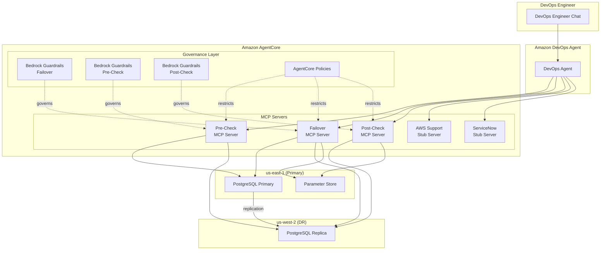
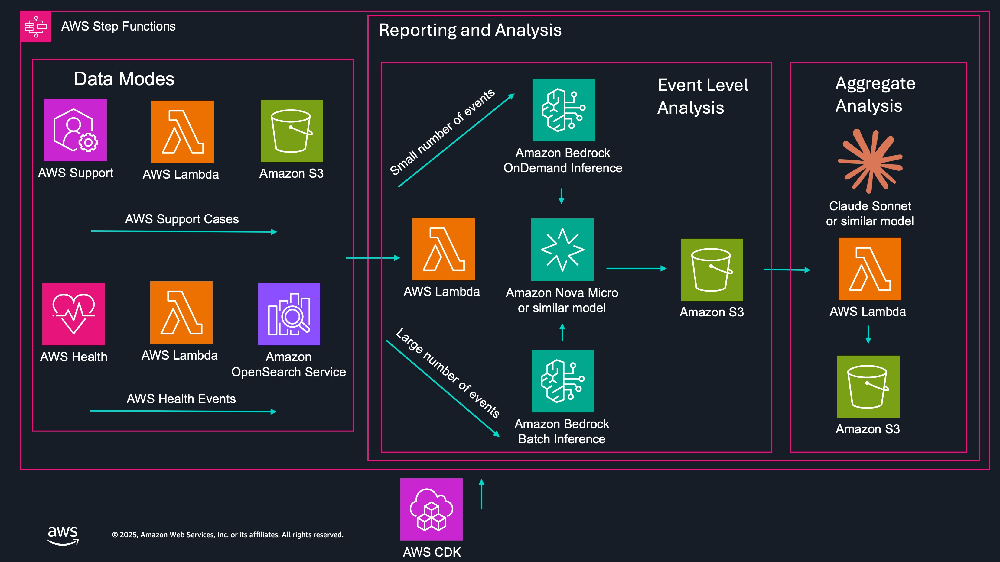
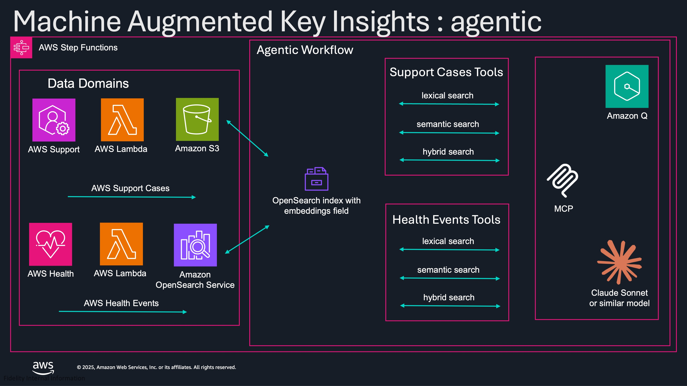

# Sample Support Data Analysis and Actions with Amazon Bedrock, DevOps Agent and AgentCore

This repository contains two self-contained projects that demonstrate AI-powered operations using Amazon's GenAI and AgenticAI services.

## Projects

### [MAKITA — Machine Augmented Key Infrastructure Technology Automation](makita/README.md)

MAKITA is a technical reference architecture demonstrating AI-assisted disaster recovery using Amazon DevOps Agent and Amazon AgentCore. It provisions a multi-region PostgreSQL cluster (us-east-1 primary, us-west-2 DR) and orchestrates automated failover through MCP servers built with the Strands Agents SDK, with governance via Cedar policies and Bedrock Guardrails.



### [MAKI — Machine Augmented Key Insights](maki/README.md)

MAKI is a sample application that uses Amazon Bedrock to analyze AWS Enterprise Support cases and AWS Health events. It automates categorization, sentiment analysis, and generates actionable recommendations through both batch reporting and an interactive agentic workflow.

Note that MAKI pattern is now considered legacy and no longer maintained.  

#### Reporting and Analysis



#### Agentic Workflow



## Repository Structure

```
.
├── makita/                 # MAKITA project
├── maki/                   # MAKI project
├── CODE_OF_CONDUCT.md
├── CONTRIBUTING.md
├── LICENSE
└── README.md
```

Each project is self-contained with its own CDK configuration, dependencies, and documentation. See the individual project READMEs for details.

## License

This project is licensed under the MIT-0 License. See the [LICENSE](LICENSE) file.
