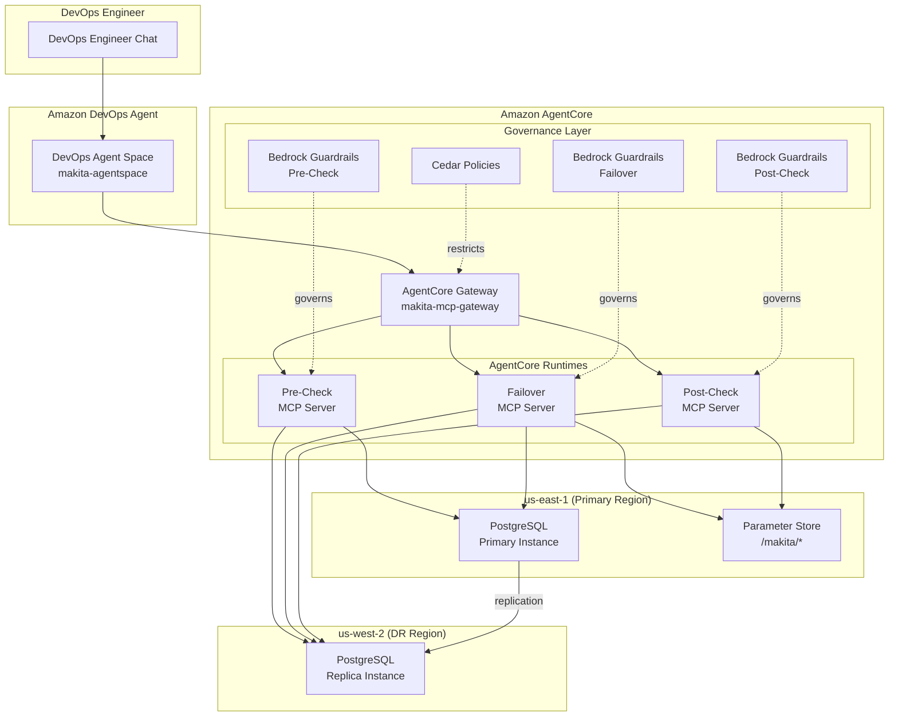

# Sample Support Data Analysis and Actions with Amazon Bedrock, DevOps Agent and AgentCore

This repository demonstrates AI-powered operations using Amazon's GenAI and Agentic AI services.

## [MAKITA — Machine Augmented Key Infrastructure Technology Automation](makita/README.md)

MAKITA is a sample application demonstrating AI-assisted disaster recovery using Amazon DevOps Agent and Amazon AgentCore. It provisions a multi-region PostgreSQL cluster (us-east-1 primary, us-west-2 DR) and orchestrates automated failover through MCP servers built with governance via Cedar policies and Bedrock Guardrails.

See the [MAKITA README](makita/README.md) for prerequisites, architecture, and deployment instructions.



## Repository Structure

```
.
├── makita/                 # MAKITA project
├── CODE_OF_CONDUCT.md
├── CONTRIBUTING.md
├── LICENSE
└── README.md
```

## License

This project is licensed under the MIT-0 License. See the [LICENSE](LICENSE) file.

---

> **Note:** MAKI (Machine Augmented Key Insights) has been updated to MAKITA with new agentic patterns.
