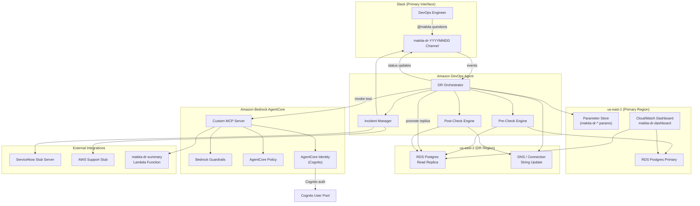
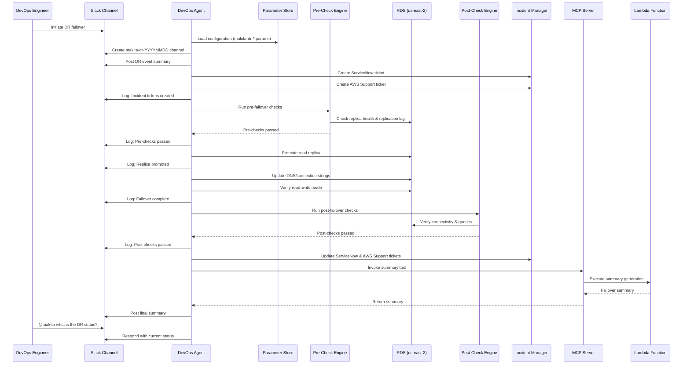

# Design Document: DevOps Agent DR Reference Architecture

## Overview

This design describes a reference architecture for Amazon DevOps Agent orchestrating a Disaster Recovery (DR) failover of an RDS Postgres database from us-east-1 (primary) to us-east-2 (DR). The system uses a custom MCP server on Amazon Bedrock AgentCore to expose DR tools, integrates with Slack as the primary communication interface, creates ServiceNow tickets via a stub server, and opens AWS Support cases. All configurable items are stored in AWS Systems Manager Parameter Store. All code is written in Python using Boto3.

The architecture demonstrates:
- Multi-region RDS Postgres failover (read replica promotion)
- Pre/post-failover validation checks
- Incident management across Slack, ServiceNow (stub), and AWS Support
- Custom MCP server on AgentCore with Lambda-based failover summary
- Bedrock Guardrails, AgentCore Policy, and AgentCore Identity (Cognito)

## Architecture



### DR Workflow Sequence



## Components and Interfaces

### 1. DR Orchestrator (`dr_orchestrator.py`)

The central coordination component that drives the DR workflow.

```python
class DROrchestrator:
    def __init__(self, config: DRConfig):
        """Initialize with configuration loaded from Parameter Store."""
        pass

    def initiate_failover(self) -> FailoverResult:
        """
        Execute the full DR failover workflow:
        1. Create Slack channel and post initial summary
        2. Create incident tickets (ServiceNow, AWS Support)
        3. Run pre-checks
        4. Promote RDS read replica
        5. Update DNS/connection strings
        6. Verify read-write mode
        7. Run post-checks
        8. Update incident tickets
        9. Generate and post failover summary via MCP
        """
        pass

    def handle_slack_question(self, question: str) -> str:
        """Respond to @makita questions in the Slack channel."""
        pass
```

### 2. Pre-Check Engine (`pre_check_engine.py`)

```python
class PreCheckEngine:
    def __init__(self, config: DRConfig):
        pass

    def run_all_checks(self) -> PreCheckResult:
        """Execute all pre-failover validations. Returns aggregated result."""
        pass

    def check_replica_health(self) -> CheckResult:
        """Verify RDS read replica is reachable and replicating."""
        pass

    def check_replication_lag(self) -> CheckResult:
        """Verify replication lag is within acceptable threshold."""
        pass

    def check_network_connectivity(self) -> CheckResult:
        """Verify DR region VPC/security groups/subnets allow DB connectivity."""
        pass
```

### 3. Post-Check Engine (`post_check_engine.py`)

```python
class PostCheckEngine:
    def __init__(self, config: DRConfig):
        pass

    def run_all_checks(self) -> PostCheckResult:
        """Execute all post-failover validations. Returns aggregated result."""
        pass

    def check_read_write_mode(self) -> CheckResult:
        """Verify promoted instance accepts read-write connections."""
        pass

    def check_application_queries(self) -> CheckResult:
        """Verify application endpoints can query the promoted database."""
        pass

    def check_dns_routing(self) -> CheckResult:
        """Verify DNS/connection strings point to promoted instance."""
        pass
```

### 4. RDS Failover Manager (`rds_failover.py`)

```python
class RDSFailoverManager:
    def __init__(self, config: DRConfig):
        pass

    def identify_instances(self) -> tuple:
        """Identify primary instance and read replica using Boto3 RDS client."""
        pass

    def promote_read_replica(self) -> PromoteResult:
        """Promote the cross-region read replica to standalone read-write."""
        pass

    def update_dns(self) -> DNSUpdateResult:
        """Update Route53 DNS records or connection strings."""
        pass

    def verify_read_write(self) -> bool:
        """Verify the promoted instance is in read-write mode."""
        pass
```

### 5. Incident Manager (`incident_manager.py`)

```python
class IncidentManager:
    def __init__(self, config: DRConfig):
        pass

    # Slack operations
    def create_slack_channel(self) -> str:
        """Create makita-dr-YYYYMMDD Slack channel. Returns channel ID."""
        pass

    def post_slack_message(self, channel_id: str, message: str) -> None:
        """Post a message to the Slack channel."""
        pass

    def log_action(self, channel_id: str, action: str) -> None:
        """Log a DR workflow action to the Slack channel."""
        pass

    # ServiceNow operations (using official SDK against stub server)
    def create_servicenow_ticket(self, event_summary: dict) -> str:
        """Create ServiceNow incident ticket. Returns ticket ID."""
        pass

    def update_servicenow_ticket(self, ticket_id: str, status: str, details: dict) -> None:
        """Update ServiceNow ticket with current status."""
        pass

    # AWS Support operations (using actual Boto3 SDK against stub)
    def create_support_ticket(self, event_summary: dict) -> str:
        """Create AWS Support case via Boto3 Support APIs (routed to stub). Returns case ID."""
        pass

    def update_support_ticket(self, case_id: str, status: str) -> None:
        """Update AWS Support case via Boto3 Support APIs (routed to stub)."""
        pass
```

### 6. Configuration Loader (`config_loader.py`)

```python
class ConfigLoader:
    PARAM_PREFIX = "/makita-dr/"

    def __init__(self, region: str = "us-east-1"):
        pass

    def load_config(self) -> DRConfig:
        """
        Load all makita-dr-* parameters from Parameter Store.
        Raises MissingConfigError if any required parameter is absent.
        """
        pass

    def _get_parameter(self, name: str, secure: bool = False) -> str:
        """Retrieve a single parameter. Uses WithDecryption for SecureString."""
        pass
```

### 7. MCP Server (`mcp_server.py`)

```python
class DRMCPServer:
    """Custom MCP server running on AgentCore."""

    def __init__(self, config: DRConfig):
        pass

    def list_tools(self) -> list:
        """Return tool definitions for DevOps Agent discovery."""
        pass

    def invoke_tool(self, tool_name: str, params: dict) -> dict:
        """
        Invoke a tool. Enforces Guardrails, authenticates via Cognito,
        and authorizes via AgentCore Policy before execution.
        """
        pass

    def generate_failover_summary(self, event_data: dict) -> dict:
        """Invoke the makita-dr-summary Lambda to generate event summary."""
        pass
```

### 8. ServiceNow Stub Server (`servicenow_stub.py`)

```python
class ServiceNowStubServer:
    """
    A lightweight HTTP server that mimics the ServiceNow REST API.
    Logs and displays all incoming requests for demonstration.
    """

    def __init__(self, host: str = "0.0.0.0", port: int = 8080):
        pass

    def start(self) -> None:
        """Start the stub server."""
        pass

    def get_request_log(self) -> list:
        """Return all received requests for verification."""
        pass
```

### 9. AWS Support Stub (`aws_support_stub.py`)

```python
class AWSSupportStub:
    """
    Intercepts Boto3 Support API calls using endpoint URL override.
    Logs and displays all received API calls for demonstration.
    Uses the actual Boto3 Support client interface.
    """

    def __init__(self, host: str = "0.0.0.0", port: int = 8081):
        pass

    def start(self) -> None:
        """Start the stub server."""
        pass

    def get_request_log(self) -> list:
        """Return all received API calls for verification."""
        pass
```

### 10. Lambda Summary Function (`makita_dr_summary/handler.py`)

```python
def handler(event: dict, context) -> dict:
    """
    Lambda handler that generates a comprehensive DR failover summary.
    Collects pre-check results, failover steps, post-check results,
    and incident management actions from the event data.
    Returns a formatted summary string.
    """
    pass
```

### 11. CloudWatch Dashboard Manager (`cloudwatch_dashboard.py`)

```python
class CloudWatchDashboardManager:
    """Creates and manages the makita-dr-dashboard CloudWatch Dashboard."""

    DASHBOARD_NAME = "makita-dr-dashboard"

    def __init__(self, config: DRConfig):
        pass

    def create_dashboard(self) -> None:
        """
        Create the CloudWatch Dashboard with widgets for:
        - Primary region RDS metrics (connections, CPU, DB connections)
        - DR region RDS metrics (replication lag, connections, CPU)
        - Cross-region comparison widgets
        """
        pass

    def _build_dashboard_body(self) -> dict:
        """Build the dashboard JSON body with all widget definitions."""
        pass
```

## Data Models

```python
from dataclasses import dataclass, field
from datetime import datetime
from enum import Enum
from typing import Optional


class FailoverStatus(Enum):
    NOT_STARTED = "not_started"
    IN_PROGRESS = "in_progress"
    COMPLETED = "completed"
    FAILED = "failed"


class CheckStatus(Enum):
    PASSED = "passed"
    FAILED = "failed"
    SKIPPED = "skipped"


@dataclass
class DRConfig:
    """Configuration loaded from Parameter Store."""
    # RDS
    primary_instance_id: str
    replica_instance_id: str
    primary_region: str  # us-east-1
    dr_region: str  # us-east-2
    replication_lag_threshold_seconds: int
    dns_record_name: str
    dns_hosted_zone_id: str

    # ServiceNow stub
    servicenow_endpoint: str
    servicenow_api_key: str  # SecureString

    # Slack
    slack_bot_token: str  # SecureString
    slack_workspace_id: str

    # AWS Support
    support_severity: str
    support_service_code: str
    support_category_code: str

    # MCP Server
    mcp_server_endpoint: str
    lambda_function_arn: str
    guardrail_id: str
    guardrail_version: str

    # Cognito
    cognito_user_pool_id: str
    cognito_client_id: str


@dataclass
class CheckResult:
    """Result of a single validation check."""
    check_name: str
    status: CheckStatus
    message: str
    timestamp: datetime = field(default_factory=datetime.utcnow)
    details: Optional[dict] = None


@dataclass
class PreCheckResult:
    """Aggregated result of all pre-failover checks."""
    checks: list  # list[CheckResult]
    overall_status: CheckStatus
    timestamp: datetime = field(default_factory=datetime.utcnow)

    @property
    def passed(self) -> bool:
        return self.overall_status == CheckStatus.PASSED


@dataclass
class PostCheckResult:
    """Aggregated result of all post-failover checks."""
    checks: list  # list[CheckResult]
    overall_status: CheckStatus
    timestamp: datetime = field(default_factory=datetime.utcnow)

    @property
    def passed(self) -> bool:
        return self.overall_status == CheckStatus.PASSED


@dataclass
class PromoteResult:
    """Result of RDS read replica promotion."""
    success: bool
    promoted_instance_id: str
    promoted_endpoint: str
    message: str
    timestamp: datetime = field(default_factory=datetime.utcnow)


@dataclass
class DNSUpdateResult:
    """Result of DNS record update."""
    success: bool
    record_name: str
    new_value: str
    message: str
    timestamp: datetime = field(default_factory=datetime.utcnow)


@dataclass
class FailoverEvent:
    """Complete record of a DR failover event."""
    event_id: str
    status: FailoverStatus
    initiated_at: datetime
    completed_at: Optional[datetime] = None
    primary_region: str = "us-east-1"
    dr_region: str = "us-east-2"
    primary_instance_id: str = ""
    replica_instance_id: str = ""
    pre_check_result: Optional[PreCheckResult] = None
    post_check_result: Optional[PostCheckResult] = None
    promote_result: Optional[PromoteResult] = None
    dns_update_result: Optional[DNSUpdateResult] = None
    servicenow_ticket_id: Optional[str] = None
    aws_support_case_id: Optional[str] = None
    slack_channel_id: Optional[str] = None
    error_message: Optional[str] = None
    actions_log: list = field(default_factory=list)  # list[str]


@dataclass
class FailoverResult:
    """Final result of the DR failover workflow."""
    event: FailoverEvent
    summary: Optional[str] = None
```


## Correctness Properties

*A property is a characteristic or behavior that should hold true across all valid executions of a system — essentially, a formal statement about what the system should do. Properties serve as the bridge between human-readable specifications and machine-verifiable correctness guarantees.*

### Property 1: Check result aggregation

*For any* set of check results (pre-check or post-check), the overall status SHALL be PASSED if and only if every individual check has status PASSED. If any individual check has status FAILED, the overall status SHALL be FAILED.

**Validates: Requirements 2.5, 2.6, 3.5, 3.6**

### Property 2: Replication lag threshold comparison

*For any* replication lag value and any configured threshold, the replication lag check SHALL pass if and only if the lag value is less than or equal to the threshold.

**Validates: Requirements 2.3**

### Property 3: Failover halts on error

*For any* failover step that raises an exception, the DR Orchestrator SHALL halt the failover sequence, log the error details, and set the failover status to FAILED. No subsequent steps SHALL execute after the error.

**Validates: Requirements 1.5**

### Property 4: Slack channel naming

*For any* date, the created Slack channel name SHALL equal "makita-dr-" concatenated with the date formatted as YYYYMMDD.

**Validates: Requirements 5.1**

### Property 5: Slack initial message completeness

*For any* DR event, the initial Slack message SHALL contain the event summary, affected database resources, and current failover status.

**Validates: Requirements 5.2**

### Property 6: Slack action logging completeness

*For any* action performed by the DevOps Agent during the DR workflow, a corresponding message SHALL be posted to the Slack channel. The number of logged messages SHALL equal the number of actions performed.

**Validates: Requirements 5.3**

### Property 7: Slack status response completeness

*For any* FailoverEvent state, when a user asks about DR status, the response SHALL contain the current failover status, the list of completed steps, and the list of pending actions.

**Validates: Requirements 5.6**

### Property 8: ServiceNow ticket field completeness

*For any* DR event, the created ServiceNow ticket SHALL contain the event summary, affected database resources, timestamp, and failover status.

**Validates: Requirements 4.3, 4.4**

### Property 9: ServiceNow ticket status updates

*For any* failover status transition, the ServiceNow ticket SHALL be updated with the new status and relevant details.

**Validates: Requirements 4.5**

### Property 10: ServiceNow stub server request logging

*For any* request sent to the ServiceNow stub server, the request SHALL appear in the stub server's request log. The number of logged requests SHALL equal the number of requests sent.

**Validates: Requirements 4.6**

### Property 11: AWS Support ticket field completeness

*For any* DR event, the created AWS Support ticket SHALL contain the event summary, affected AWS resources, severity level, Primary_Region identifier, and DR_Region identifier.

**Validates: Requirements 6.1, 6.2**

### Property 12: AWS Support ticket final status update

*For any* terminal failover status (completed or failed), the AWS Support ticket SHALL be updated with that final status.

**Validates: Requirements 6.3**

### Property 13: Retry with exponential backoff

*For any* API call (ServiceNow, Slack, AWS Support) that fails due to unreachability, the Incident Manager SHALL retry with exponential backoff. Each successive retry delay SHALL be greater than the previous delay.

**Validates: Requirements 4.7, 5.7, 6.4**

### Property 14: Lambda summary completeness

*For any* FailoverEvent, the generated summary SHALL reference pre-check results, failover steps, post-check results, and incident management actions taken.

**Validates: Requirements 7.4**

### Property 15: Guardrails enforcement and violation rejection

*For any* tool invocation request, Guardrails SHALL be evaluated. *For any* request that violates a Guardrail policy, the MCP Server SHALL reject the request and return a policy violation response.

**Validates: Requirements 8.1, 8.2**

### Property 16: Authentication and authorization enforcement

*For any* tool invocation request on the MCP Server: (a) unauthenticated requests SHALL be rejected with an authentication error, (b) authenticated requests lacking required policy permissions SHALL be rejected with an authorization error, and (c) only identities authenticated through the Cognito User Pool SHALL be permitted to invoke the Lambda summary function.

**Validates: Requirements 9.1, 9.2, 9.3, 9.4, 9.5**

### Property 17: Audit logging completeness

*For any* tool invocation attempt on the MCP Server, all Guardrail evaluation results and all authentication/authorization decisions SHALL be logged.

**Validates: Requirements 8.3, 9.6**

### Property 18: Missing configuration halts workflow

*For any* required configuration parameter, if that parameter is missing from Parameter Store, the DevOps Agent SHALL report the specific missing parameter name and halt the DR workflow.

**Validates: Requirements 10.5**

### Property 19: Resource naming prefix

*For any* AWS resource or Parameter Store parameter created by the reference architecture, the name or path SHALL start with "makita-dr-".

**Validates: Requirements 11.1, 11.2, 11.3**

### Property 20: Lambda error propagation

*For any* Lambda execution failure, the MCP Server SHALL return an error response containing the failure details to the DevOps Agent.

**Validates: Requirements 7.6**

## Error Handling

### Failover Errors
- Any exception during the failover sequence (identify, promote, DNS update, verify) halts the workflow immediately
- The error is logged with full details (step name, exception type, message, timestamp)
- FailoverEvent status is set to FAILED with the error message
- All incident tickets (ServiceNow, AWS Support) are updated with the failure status
- A failure message is posted to the Slack channel

### Pre-Check Failures
- If any individual pre-check fails, the overall PreCheckResult status is FAILED
- The failure details (which check, why it failed) are included in the result
- The orchestrator does not proceed to failover
- The failure is logged to the Slack channel

### Post-Check Failures
- If any individual post-check fails, the overall PostCheckResult status is FAILED
- The failure details are reported to the DevOps Agent for remediation
- The failure is logged to the Slack channel
- Incident tickets are updated to reflect the post-check failure

### External API Failures (ServiceNow, Slack, AWS Support)
- All external API calls use a shared retry mechanism with exponential backoff
- Maximum retry attempts: 3 (configurable via Parameter Store)
- Base delay: 1 second, multiplied by 2^attempt (1s, 2s, 4s)
- After max retries, the failure is logged but does not halt the DR workflow
- The orchestrator continues with remaining steps

### MCP Server Errors
- Guardrail violations return a structured error response with the violated policy details
- Authentication failures return HTTP 401 with an error message
- Authorization failures return HTTP 403 with an error message
- Lambda execution failures return the Lambda error details in the response
- All errors are logged for audit

### Configuration Errors
- Missing required parameters raise MissingConfigError with the parameter name
- The DR workflow halts before any actions are taken
- The error is reported to the caller (no Slack channel exists yet at this point)

## Testing Strategy

### Property-Based Testing

Use `hypothesis` (Python) as the property-based testing library. Each property test runs a minimum of 100 iterations.

Property tests target the core logic that can be tested without AWS infrastructure:

- **Check result aggregation** (Property 1): Generate random lists of CheckResult with varying statuses, verify aggregation logic
- **Replication lag threshold** (Property 2): Generate random lag values and thresholds, verify comparison
- **Failover halts on error** (Property 3): Generate random failover step sequences with injected errors, verify halt behavior
- **Slack channel naming** (Property 4): Generate random dates, verify channel name format
- **Slack message completeness** (Properties 5, 6, 7): Generate random events and actions, verify message content
- **Ticket field completeness** (Properties 8, 9, 10, 11, 12): Generate random events, verify ticket fields
- **Retry backoff** (Property 13): Generate random failure sequences, verify delay progression
- **Lambda summary completeness** (Property 14): Generate random FailoverEvent data, verify summary sections
- **Guardrails enforcement** (Property 15): Generate random requests with/without violations, verify behavior
- **Auth enforcement** (Property 16): Generate random auth states, verify accept/reject behavior
- **Audit logging** (Property 17): Generate random invocation attempts, verify log entries
- **Missing config** (Property 18): Generate random config with missing fields, verify error reporting
- **Resource naming** (Property 19): Generate random resource names, verify prefix
- **Lambda error propagation** (Property 20): Generate random Lambda errors, verify error response

Each test is tagged with: `Feature: devops-agent-dr-reference, Property {N}: {title}`

### Unit Testing

Unit tests complement property tests for specific examples and edge cases:

- Config loader with all parameters present (happy path)
- Config loader with SecureString decryption
- ServiceNow stub server request/response cycle
- Slack channel creation with specific date
- RDS failover manager API call verification (mocked Boto3)
- MCP server tool listing
- Lambda handler with complete vs. partial event data

### Integration Testing

Integration tests verify end-to-end flows with mocked AWS services (using `moto` or `localstack`):

- Full DR workflow happy path
- DR workflow with pre-check failure
- DR workflow with failover error
- DR workflow with post-check failure
- Slack @makita question/response flow
- ServiceNow stub server end-to-end
