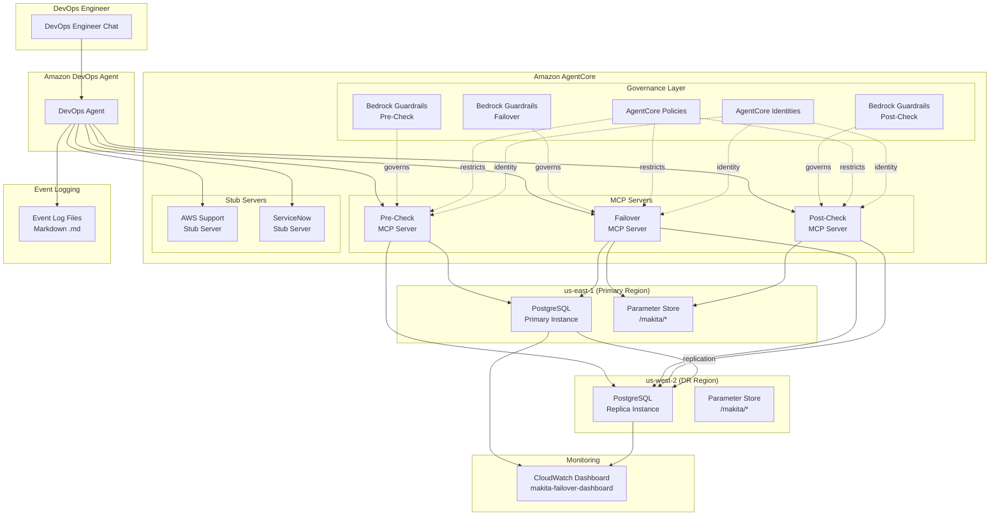
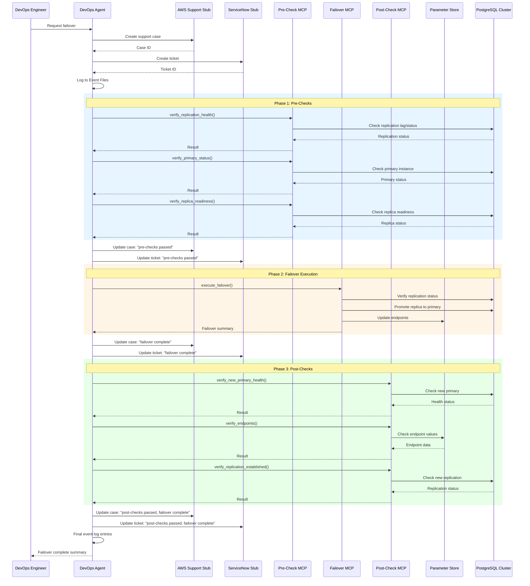

# Design Document: MAKITA

## Overview

MAKITA (Machine Augmented Key Infrastructure Technology Automation) is a technical reference architecture demonstrating AI-assisted disaster recovery using Amazon DevOps Agent and Amazon AgentCore. The system provisions a multi-region PostgreSQL cluster (us-east-1 primary, us-west-2 DR) via a single CloudFormation stack and orchestrates automated failover through MCP servers built with the Strands SDK.

The architecture follows a separation-of-concerns model with three dedicated MCP servers:
- **Failover MCP Server** — executes the actual PostgreSQL promotion and endpoint updates
- **Pre-Check MCP Server** — validates cluster health before failover
- **Post-Check MCP Server** — verifies cluster state after failover

Two stub MCP servers simulate external ticketing systems (AWS Support and ServiceNow) for tracking DR operations. All servers are hosted in AgentCore, governed by AgentCore Policies/Identities and Bedrock Guardrails, and driven by DevOps Agent through natural language interactions.

All infrastructure is defined in a single CloudFormation template, all configuration lives in Parameter Store under `/makita/`, and all resources use the `makita-` naming prefix. Every AWS resource carries mandatory tags (`auto-delete=no`, `Env=prod1`) for lifecycle management and environment identification. AgentCore Policies enforce that MCP servers only operate on resources tagged with `Env=prod1`, providing an additional layer of environment isolation beyond the `makita-` prefix constraint.

A standalone architectural diagram (Mermaid syntax) is maintained as a separate artifact for independent review of the system architecture.

## Architecture

### High-Level Architecture Diagram



### Failover Sequence Flow




## Components and Interfaces

### 1. CloudFormation Template (`makita-stack.yaml`)

A single CloudFormation template that provisions all MAKITA resources as one atomic unit. Uses `AWS::CloudFormation::StackSet` or cross-region resource providers where needed for us-west-2 resources.

**Key Resource Groups:**

| Resource Group | Resources | Region(s) |
|---|---|---|
| PostgreSQL Cluster | `makita-pg-primary` (RDS), `makita-pg-replica` (RDS Read Replica) | us-east-1, us-west-2 |
| Parameter Store | `/makita/db/primary-endpoint`, `/makita/db/replica-endpoint`, `/makita/db/primary-region`, `/makita/db/dr-region`, `/makita/db/replication-status` | us-east-1 |
| MCP Servers | `makita-failover-mcp`, `makita-precheck-mcp`, `makita-postcheck-mcp` | us-east-1 |
| Stub Servers | `makita-aws-support-stub`, `makita-servicenow-stub` | us-east-1 |
| AgentCore | `makita-failover-policy`, `makita-precheck-policy`, `makita-postcheck-policy`, `makita-failover-identity`, `makita-precheck-identity`, `makita-postcheck-identity` | us-east-1 |
| Bedrock Guardrails | `makita-failover-guardrail`, `makita-precheck-guardrail`, `makita-postcheck-guardrail` | us-east-1 |
| CloudWatch | `makita-failover-dashboard` | us-east-1 |
| IAM | `makita-failover-role`, `makita-precheck-role`, `makita-postcheck-role` | us-east-1 |

**Naming Convention:** All resource names, logical IDs, and tags use the `makita-` prefix. Parameter Store paths use `/makita/` prefix.

**Mandatory Resource Tags:** Every AWS resource in the stack must carry the following tags:

```yaml
Tags:
  - Key: auto-delete
    Value: "no"
  - Key: Env
    Value: prod1
```

These tags are applied to all resource types: RDS instances, IAM roles, SSM parameters, AgentCore MCP servers/policies/identities, Bedrock Guardrails, and the CloudWatch Dashboard. Resources that do not support CloudFormation tagging (e.g., `AWS::CloudWatch::Dashboard` body content) are documented as exceptions via inline comments in the template.

### 2. Failover MCP Server (`makita-failover-mcp`)

Built with the Strands SDK. Hosted in AgentCore. Executes the core failover operation.

**Tools Exposed:**

```python
@tool
def execute_failover(
    primary_region: str,    # "us-east-1"
    dr_region: str,         # "us-west-2"
    cluster_name: str       # "makita-pg-cluster"
) -> FailoverResult:
    """
    Promotes the DR replica to primary. Verifies replication status first,
    promotes the replica, updates Parameter Store endpoints, and returns
    a summary with new primary endpoint, previous primary endpoint, and
    failover duration.
    """

@tool
def health_check(
    cluster_name: str
) -> HealthCheckResult:
    """
    Returns the current health status of the PostgreSQL cluster including
    primary status, replica status, and replication lag.
    """
```

**Response Schema — `FailoverResult`:**
```json
{
  "success": true,
  "new_primary_endpoint": "makita-pg-replica.us-west-2.rds.amazonaws.com",
  "previous_primary_endpoint": "makita-pg-primary.us-east-1.rds.amazonaws.com",
  "failover_duration_seconds": 45,
  "endpoints_updated": true,
  "error": null
}
```

**Response Schema — `HealthCheckResult`:**
```json
{
  "cluster_name": "makita-pg-cluster",
  "primary_status": "available",
  "replica_status": "available",
  "replication_lag_seconds": 0,
  "replication_healthy": true
}
```

### 3. Pre-Check MCP Server (`makita-precheck-mcp`)

Built with the Strands SDK. Hosted in AgentCore. Performs all pre-failover verifications.

**Tools Exposed:**

```python
@tool
def verify_replication_health(
    cluster_name: str
) -> VerificationResult:
    """
    Checks replication lag, replication state, and data consistency
    between primary and replica.
    """

@tool
def verify_primary_status(
    cluster_name: str,
    primary_region: str     # "us-east-1"
) -> VerificationResult:
    """
    Verifies the primary instance is in a known status (available, degraded,
    or failed) in the Primary Region.
    """

@tool
def verify_replica_readiness(
    cluster_name: str,
    dr_region: str          # "us-west-2"
) -> VerificationResult:
    """
    Verifies the replica instance in the DR Region is healthy and ready
    for promotion (replication caught up, instance available).
    """
```

**Response Schema — `VerificationResult`:**
```json
{
  "check_name": "replication_health",
  "passed": true,
  "details": {
    "replication_lag_seconds": 0,
    "replication_state": "streaming",
    "primary_status": "available",
    "replica_status": "available"
  },
  "error": null
}
```

### 4. Post-Check MCP Server (`makita-postcheck-mcp`)

Built with the Strands SDK. Hosted in AgentCore. Performs all post-failover verifications.

**Tools Exposed:**

```python
@tool
def verify_new_primary_health(
    cluster_name: str,
    dr_region: str          # "us-west-2"
) -> VerificationResult:
    """
    Verifies the promoted instance in the DR Region is healthy and
    accepting connections as the new primary.
    """

@tool
def verify_endpoints(
    cluster_name: str
) -> VerificationResult:
    """
    Verifies that Parameter Store endpoint values (/makita/db/primary-endpoint,
    /makita/db/replica-endpoint) reflect the new primary instance in us-west-2.
    """

@tool
def verify_replication_established(
    cluster_name: str
) -> VerificationResult:
    """
    Verifies that replication from the new primary instance is established
    (if a new replica has been configured).
    """
```

### 5. AWS Support Stub Server (`makita-aws-support-stub`)

An MCP server simulating the AWS Support API. Stores cases in-memory.

**Tools Exposed:**

```python
@tool
def create_support_case(
    subject: str,
    description: str,
    severity: str           # "critical", "high", "normal", "low"
) -> CreateCaseResult:
    """Creates a new AWS Support case. Returns a unique case ID."""

@tool
def update_support_case(
    case_id: str,
    status: str,
    update_description: str
) -> UpdateCaseResult:
    """Updates an existing case with new status. Returns error if case not found."""
```

**Response Schema — `CreateCaseResult`:**
```json
{
  "case_id": "makita-case-20240101-001",
  "subject": "PostgreSQL Failover DR Operation",
  "status": "opened",
  "created_at": "2024-01-01T12:00:00Z"
}
```

**Response Schema — `UpdateCaseResult`:**
```json
{
  "case_id": "makita-case-20240101-001",
  "status": "failover initiated",
  "updated_at": "2024-01-01T12:05:00Z",
  "error": null
}
```

### 6. ServiceNow Stub Server (`makita-servicenow-stub`)

An MCP server simulating the ServiceNow API. Stores tickets in-memory.

**Tools Exposed:**

```python
@tool
def create_ticket(
    short_description: str,
    description: str,
    priority: str,          # "1-Critical", "2-High", "3-Medium", "4-Low"
    category: str           # "Disaster Recovery"
) -> CreateTicketResult:
    """Creates a new ServiceNow ticket. Returns a unique ticket ID."""

@tool
def update_ticket(
    ticket_id: str,
    status: str,
    work_notes: str
) -> UpdateTicketResult:
    """Updates an existing ticket with new status. Returns error if ticket not found."""
```

**Response Schema — `CreateTicketResult`:**
```json
{
  "ticket_id": "INC0010001",
  "short_description": "PostgreSQL Failover DR Operation",
  "status": "New",
  "created_at": "2024-01-01T12:00:00Z"
}
```

**Response Schema — `UpdateTicketResult`:**
```json
{
  "ticket_id": "INC0010001",
  "status": "failover initiated",
  "updated_at": "2024-01-01T12:05:00Z",
  "error": null
}
```

### 7. AgentCore Governance

#### AgentCore Policies

Three policies, one per MCP server, each enforcing:

| Constraint | Failover MCP | Pre-Check MCP | Post-Check MCP |
|---|---|---|---|
| Resource prefix | `makita-*` | `makita-*` | `makita-*` |
| Resource tag | `Env=prod1` | `Env=prod1` | `Env=prod1` |
| Allowed regions | us-east-1 → us-west-2 | us-east-1, us-west-2 | us-east-1, us-west-2 |
| Principal prefix | `makita-*` | `makita-*` | `makita-*` |
| Allowed actions | failover operations | pre-check read operations | post-check read operations |

The `Env=prod1` tag constraint is enforced in addition to the `makita-*` resource prefix, region, and principal constraints. If an MCP server attempts to operate on a resource that does not carry the `Env=prod1` tag, the policy denies the operation regardless of whether the resource name matches the `makita-*` prefix. This provides defense-in-depth: the prefix constraint ensures naming isolation, while the tag constraint ensures environment isolation.

#### AgentCore Identities

Three identities, one per MCP server, each mapping to a dedicated IAM role:

- `makita-failover-identity` → `makita-failover-role`
- `makita-precheck-identity` → `makita-precheck-role`
- `makita-postcheck-identity` → `makita-postcheck-role`

#### Bedrock Guardrails

Three guardrails, one per MCP server:

- `makita-failover-guardrail` — restricts to DR failover actions on PostgreSQL, blocks prompt injection
- `makita-precheck-guardrail` — restricts to pre-check read actions on PostgreSQL, blocks prompt injection
- `makita-postcheck-guardrail` — restricts to post-check read actions on PostgreSQL, blocks prompt injection

Each guardrail evaluates requests before the MCP server processes them and includes:
- Content filtering for malicious prompts
- Prompt injection detection and blocking
- Topic restriction to disaster recovery operations only
- Denied topic list for non-DR operations

### 8. Event Logging

DevOps Agent writes markdown event log files for each support case and ServiceNow ticket.

**File naming:** `event-log-{case_id_or_ticket_id}.md`

**File format:**
```markdown
# Event Log: {case_id_or_ticket_id}

## Events

- **2024-01-01T12:00:00Z** — AWS Support case makita-case-20240101-001 created
- **2024-01-01T12:01:00Z** — ServiceNow ticket INC0010001 created
- **2024-01-01T12:02:00Z** — Pre-checks initiated
- **2024-01-01T12:02:30Z** — Replication health verified: lag 0s, state streaming
- **2024-01-01T12:03:00Z** — Primary status verified: available in us-east-1
- **2024-01-01T12:03:30Z** — Replica readiness verified: ready for promotion in us-west-2
- **2024-01-01T12:04:00Z** — Failover initiated on makita-pg-cluster
- **2024-01-01T12:04:45Z** — Replica promoted to primary in us-west-2
- **2024-01-01T12:05:00Z** — Endpoints updated in Parameter Store
- **2024-01-01T12:05:30Z** — Post-checks initiated
- **2024-01-01T12:06:00Z** — New primary health verified in us-west-2
- **2024-01-01T12:06:30Z** — Failover complete
```

### 9. CloudWatch Dashboard (`makita-failover-dashboard`)

Provisioned via CloudFormation. Displays:

- **Primary Region (us-east-1):** CPU utilization, DB connections, read/write IOPS, instance status
- **DR Region (us-west-2):** CPU utilization, DB connections, read/write IOPS, instance status
- **Cross-Region:** Replication lag, replication status, failover event annotations
- **Health:** Instance availability status for both regions

### 10. DevOps Agent Chat Integration

DevOps Agent displays each step of the failover sequence in the chat as it happens. The agent connects to all five MCP servers and orchestrates the failover sequence:

1. Create AWS Support case and ServiceNow ticket
2. Execute Pre-Checks (via Pre-Check MCP Server)
3. Execute Failover (via Failover MCP Server)
4. Execute Post-Checks (via Post-Check MCP Server)
5. Update tickets at each phase transition
6. Log events to markdown files
7. Display summary to user

### 11. Standalone Architectural Diagram (`architecture.md`)

A standalone Mermaid-syntax architectural diagram maintained as a separate artifact from the README. This file provides an independent, version-controlled view of the MAKITA system architecture.

**File:** `architecture.md` (project root)

**Required Components:**

| Component | Details |
|---|---|
| PostgreSQL Cluster | Primary instance (us-east-1) and replica instance (us-west-2) with replication relationship |
| CloudWatch Dashboard | `makita-failover-dashboard` |
| MCP Servers | Failover, Pre-Check, Post-Check |
| Stub Servers | AWS Support Stub, ServiceNow Stub |
| AgentCore Governance | Policies, Identities, Guardrails |
| DevOps Agent | With connections to all MCP and stub servers |
| Parameter Store | `/makita/*` parameters |
| Data Flows | Relationships between all components |

**Diagram Content:**

The diagram uses Mermaid `graph TB` syntax and includes:
- Subgraphs for each logical grouping (DevOps Agent, AgentCore with governance and servers, primary region, DR region, monitoring)
- Directed edges showing data flow and control flow
- Replication relationship between primary and replica PostgreSQL instances
- Governance relationships (guardrails → MCP servers, policies → MCP servers, identities → MCP servers)
- DevOps Agent connections to all five MCP/stub servers

This diagram mirrors the High-Level Architecture Diagram in the design document but is maintained as a standalone artifact for independent review per Requirement 26.


## Data Models

### Parameter Store Schema

All parameters stored under the `/makita/` prefix:

| Parameter Path | Type | Description |
|---|---|---|
| `/makita/db/primary-endpoint` | String | Current primary PostgreSQL endpoint |
| `/makita/db/replica-endpoint` | String | Current replica PostgreSQL endpoint |
| `/makita/db/primary-region` | String | Current primary region (us-east-1 or us-west-2) |
| `/makita/db/dr-region` | String | Current DR region |
| `/makita/db/cluster-name` | String | PostgreSQL cluster name (makita-pg-cluster) |
| `/makita/db/replication-status` | String | Current replication status |
| `/makita/db/port` | String | PostgreSQL port (5432) |
| `/makita/mcp/failover-server-arn` | String | ARN of the Failover MCP Server in AgentCore |
| `/makita/mcp/precheck-server-arn` | String | ARN of the Pre-Check MCP Server in AgentCore |
| `/makita/mcp/postcheck-server-arn` | String | ARN of the Post-Check MCP Server in AgentCore |
| `/makita/dashboard/name` | String | CloudWatch dashboard name |

### CloudFormation Resource Structure

```yaml
AWSTemplateFormatVersion: '2010-09-09'
Description: MAKITA - Single stack for multi-region PostgreSQL DR with MCP servers

Resources:
  # --- PostgreSQL Cluster ---
  MakitaPgPrimary:
    Type: AWS::RDS::DBInstance
    Properties:
      DBInstanceIdentifier: makita-pg-primary
      Engine: postgres
      # ... primary config for us-east-1
      Tags:
        - Key: auto-delete
          Value: "no"
        - Key: Env
          Value: prod1

  MakitaPgReplica:
    Type: AWS::RDS::DBInstance
    Properties:
      DBInstanceIdentifier: makita-pg-replica
      SourceDBInstanceIdentifier: !Ref MakitaPgPrimary
      # ... replica config, cross-region to us-west-2
      Tags:
        - Key: auto-delete
          Value: "no"
        - Key: Env
          Value: prod1

  # --- Parameter Store ---
  MakitaParamPrimaryEndpoint:
    Type: AWS::SSM::Parameter
    Properties:
      Name: /makita/db/primary-endpoint
      Type: String
      Value: !GetAtt MakitaPgPrimary.Endpoint.Address
      Tags:
        auto-delete: "no"
        Env: prod1

  MakitaParamReplicaEndpoint:
    Type: AWS::SSM::Parameter
    Properties:
      Name: /makita/db/replica-endpoint
      Type: String
      Value: !GetAtt MakitaPgReplica.Endpoint.Address
      Tags:
        auto-delete: "no"
        Env: prod1

  # --- IAM Roles ---
  MakitaFailoverRole:
    Type: AWS::IAM::Role
    Properties:
      RoleName: makita-failover-role
      # ... permissions for RDS failover, SSM parameter updates
      Tags:
        - Key: auto-delete
          Value: "no"
        - Key: Env
          Value: prod1

  MakitaPrecheckRole:
    Type: AWS::IAM::Role
    Properties:
      RoleName: makita-precheck-role
      # ... read-only permissions for RDS describe, SSM get
      Tags:
        - Key: auto-delete
          Value: "no"
        - Key: Env
          Value: prod1

  MakitaPostcheckRole:
    Type: AWS::IAM::Role
    Properties:
      RoleName: makita-postcheck-role
      # ... read-only permissions for RDS describe, SSM get
      Tags:
        - Key: auto-delete
          Value: "no"
        - Key: Env
          Value: prod1

  # --- AgentCore MCP Server Registrations ---
  MakitaFailoverMcpServer:
    Type: AWS::AgentCore::McpServer
    Properties:
      ServerName: makita-failover-mcp
      # ... Strands SDK configuration
      Tags:
        - Key: auto-delete
          Value: "no"
        - Key: Env
          Value: prod1

  MakitaPrecheckMcpServer:
    Type: AWS::AgentCore::McpServer
    Properties:
      ServerName: makita-precheck-mcp
      Tags:
        - Key: auto-delete
          Value: "no"
        - Key: Env
          Value: prod1

  MakitaPostcheckMcpServer:
    Type: AWS::AgentCore::McpServer
    Properties:
      ServerName: makita-postcheck-mcp
      Tags:
        - Key: auto-delete
          Value: "no"
        - Key: Env
          Value: prod1

  MakitaAwsSupportStub:
    Type: AWS::AgentCore::McpServer
    Properties:
      ServerName: makita-aws-support-stub
      Tags:
        - Key: auto-delete
          Value: "no"
        - Key: Env
          Value: prod1

  MakitaServicenowStub:
    Type: AWS::AgentCore::McpServer
    Properties:
      ServerName: makita-servicenow-stub
      Tags:
        - Key: auto-delete
          Value: "no"
        - Key: Env
          Value: prod1

  # --- AgentCore Policies ---
  MakitaFailoverPolicy:
    Type: AWS::AgentCore::Policy
    Properties:
      PolicyName: makita-failover-policy
      # Resource constraint: makita-*
      # Resource tag constraint: Env=prod1
      # Region constraint: us-east-1, us-west-2
      # Principal constraint: makita-*
      Tags:
        - Key: auto-delete
          Value: "no"
        - Key: Env
          Value: prod1

  MakitaPrecheckPolicy:
    Type: AWS::AgentCore::Policy
    Properties:
      PolicyName: makita-precheck-policy
      # Resource constraint: makita-*
      # Resource tag constraint: Env=prod1
      # Region constraint: us-east-1, us-west-2
      # Principal constraint: makita-*
      Tags:
        - Key: auto-delete
          Value: "no"
        - Key: Env
          Value: prod1

  MakitaPostcheckPolicy:
    Type: AWS::AgentCore::Policy
    Properties:
      PolicyName: makita-postcheck-policy
      # Resource constraint: makita-*
      # Resource tag constraint: Env=prod1
      # Region constraint: us-east-1, us-west-2
      # Principal constraint: makita-*
      Tags:
        - Key: auto-delete
          Value: "no"
        - Key: Env
          Value: prod1

  # --- AgentCore Identities ---
  MakitaFailoverIdentity:
    Type: AWS::AgentCore::Identity
    Properties:
      IdentityName: makita-failover-identity
      RoleArn: !GetAtt MakitaFailoverRole.Arn
      Tags:
        - Key: auto-delete
          Value: "no"
        - Key: Env
          Value: prod1

  MakitaPrecheckIdentity:
    Type: AWS::AgentCore::Identity
    Properties:
      IdentityName: makita-precheck-identity
      RoleArn: !GetAtt MakitaPrecheckRole.Arn
      Tags:
        - Key: auto-delete
          Value: "no"
        - Key: Env
          Value: prod1

  MakitaPostcheckIdentity:
    Type: AWS::AgentCore::Identity
    Properties:
      IdentityName: makita-postcheck-identity
      RoleArn: !GetAtt MakitaPostcheckRole.Arn
      Tags:
        - Key: auto-delete
          Value: "no"
        - Key: Env
          Value: prod1

  # --- Bedrock Guardrails ---
  MakitaFailoverGuardrail:
    Type: AWS::Bedrock::Guardrail
    Properties:
      Name: makita-failover-guardrail
      BlockedInputMessaging: "Operation blocked by guardrail policy"
      BlockedOutputsMessaging: "Response blocked by guardrail policy"
      # Content policy, topic policy, prompt injection detection
      Tags:
        - Key: auto-delete
          Value: "no"
        - Key: Env
          Value: prod1

  MakitaPrecheckGuardrail:
    Type: AWS::Bedrock::Guardrail
    Properties:
      Name: makita-precheck-guardrail
      Tags:
        - Key: auto-delete
          Value: "no"
        - Key: Env
          Value: prod1

  MakitaPostcheckGuardrail:
    Type: AWS::Bedrock::Guardrail
    Properties:
      Name: makita-postcheck-guardrail
      Tags:
        - Key: auto-delete
          Value: "no"
        - Key: Env
          Value: prod1

  # --- CloudWatch Dashboard ---
  # NOTE: AWS::CloudWatch::Dashboard does not support the Tags property.
  # This is documented as a tagging exception per Requirement 24.10.
  MakitaFailoverDashboard:
    Type: AWS::CloudWatch::Dashboard
    Properties:
      DashboardName: makita-failover-dashboard
      DashboardBody: !Sub |
        {
          "widgets": [
            {
              "type": "metric",
              "properties": {
                "title": "Primary (us-east-1) - CPU",
                "metrics": [["AWS/RDS", "CPUUtilization", "DBInstanceIdentifier", "makita-pg-primary"]],
                "region": "us-east-1"
              }
            },
            {
              "type": "metric",
              "properties": {
                "title": "Replica (us-west-2) - CPU",
                "metrics": [["AWS/RDS", "CPUUtilization", "DBInstanceIdentifier", "makita-pg-replica"]],
                "region": "us-west-2"
              }
            },
            {
              "type": "metric",
              "properties": {
                "title": "Replication Lag",
                "metrics": [["AWS/RDS", "ReplicaLag", "DBInstanceIdentifier", "makita-pg-replica"]],
                "region": "us-west-2"
              }
            }
          ]
        }

Outputs:
  PrimaryEndpoint:
    Value: !GetAtt MakitaPgPrimary.Endpoint.Address
  ReplicaEndpoint:
    Value: !GetAtt MakitaPgReplica.Endpoint.Address
  FailoverMcpServerArn:
    Value: !Ref MakitaFailoverMcpServer
  DashboardUrl:
    Value: !Sub "https://console.aws.amazon.com/cloudwatch/home?region=us-east-1#dashboards:name=makita-failover-dashboard"
```

### MCP Server Internal Data Models

#### Stub Server In-Memory Storage

```python
# AWS Support Stub - in-memory store
support_cases: dict[str, SupportCase] = {}

@dataclass
class SupportCase:
    case_id: str            # "makita-case-{date}-{seq}"
    subject: str
    description: str
    severity: str
    status: str
    created_at: str         # ISO 8601
    updates: list[CaseUpdate]

@dataclass
class CaseUpdate:
    status: str
    description: str
    updated_at: str         # ISO 8601

# ServiceNow Stub - in-memory store
tickets: dict[str, ServiceNowTicket] = {}

@dataclass
class ServiceNowTicket:
    ticket_id: str          # "INC{seq:07d}"
    short_description: str
    description: str
    priority: str
    category: str
    status: str
    created_at: str         # ISO 8601
    work_notes: list[WorkNote]

@dataclass
class WorkNote:
    status: str
    notes: str
    updated_at: str         # ISO 8601
```

#### Failover State Tracking

```python
@dataclass
class FailoverState:
    cluster_name: str
    primary_region: str
    dr_region: str
    previous_primary_endpoint: str
    new_primary_endpoint: str
    started_at: str         # ISO 8601
    completed_at: str | None
    duration_seconds: float | None
    status: str             # "initiated", "replication_verified", "promotion_started",
                            # "promotion_completed", "endpoints_updated", "complete", "failed"
    error: str | None
```

#### Ticket Update Context

Each ticket update includes contextual information per Requirement 13:

```python
@dataclass
class TicketUpdateContext:
    phase: str              # "pre-check", "failover", "post-check"
    status: str             # e.g., "failover initiated", "replication verified"
    resource_names: list[str]   # e.g., ["makita-pg-primary", "makita-pg-replica"]
    parameter_paths: list[str]  # e.g., ["/makita/db/primary-endpoint"]
    agentcore_resources: list[str]  # e.g., ["makita-failover-mcp"]
    primary_region: str     # "us-east-1"
    dr_region: str          # "us-west-2"
    endpoints: dict[str, str]   # {"primary": "...", "replica": "..."}
    replication_status: str | None
    iam_role: str | None
    error_code: str | None
    error_message: str | None
    mcp_server: str         # which MCP server is involved
```


## Correctness Properties

*A property is a characteristic or behavior that should hold true across all valid executions of a system — essentially, a formal statement about what the system should do. Properties serve as the bridge between human-readable specifications and machine-verifiable correctness guarantees.*

### Property 1: Resource naming prefix

*For any* AWS resource defined in the CloudFormation template, the resource name (DBInstanceIdentifier, RoleName, ServerName, PolicyName, IdentityName, guardrail Name, DashboardName) must start with `makita-`.

**Validates: Requirements 1.4, 7.1**

### Property 2: Parameter Store path prefix

*For any* SSM Parameter defined in the CloudFormation template, the parameter `Name` must start with `/makita/`.

**Validates: Requirements 2.2, 7.3**

### Property 3: Mandatory resource tags

*For any* AWS resource in the CloudFormation template that supports tagging, the resource must include both tags: `auto-delete` with value `no` and `Env` with value `prod1`.

**Validates: Requirements 24.1, 24.2, 24.3, 24.4, 24.5, 24.6, 24.7, 24.8, 24.9**

### Property 4: AgentCore policy enforcement — Env tag constraint

*For any* MCP server (Failover, Pre-Check, Post-Check) and *for any* AWS resource that does not have the tag `Env=prod1`, the AgentCore policy must deny the operation on that resource.

**Validates: Requirements 25.1, 25.2, 25.3, 25.4, 25.5, 25.6**

### Property 5: AgentCore policy enforcement — resource prefix, region, and principal constraints

*For any* MCP server (Failover, Pre-Check, Post-Check), operations must be denied if the target resource name does not start with `makita-`, the target region is not in {us-east-1, us-west-2}, or the principal name does not start with `makita-`.

**Validates: Requirements 9.1, 9.2, 9.3, 9.5, 9.6, 9.7, 20.1, 20.2, 20.3, 20.4, 20.5, 20.6, 20.9, 20.10, 20.11, 20.12, 20.13, 20.14**

### Property 6: MCP tool response structure

*For any* tool invocation on any MCP server (Failover, Pre-Check, Post-Check), the response must contain a success/passed status field and an error field (null on success, structured error message on failure).

**Validates: Requirements 4.4, 4.5, 18.7, 18.8, 19.7, 19.8**

### Property 7: Failover endpoint update round trip

*For any* successful failover execution, the Parameter Store values for `/makita/db/primary-endpoint` and `/makita/db/replica-endpoint` must be updated to reflect the new primary (previously the replica) and the previous primary, and reading those parameters back must return the updated values.

**Validates: Requirements 6.2, 6.5**

### Property 8: Stub server unique ID generation

*For any* sequence of case/ticket creation calls to the AWS Support Stub Server or ServiceNow Stub Server, every returned case_id/ticket_id must be unique across all creations.

**Validates: Requirements 11.4, 12.4**

### Property 9: Stub server update on non-existent ID returns error

*For any* case_id or ticket_id that has not been created, calling update on the AWS Support Stub Server or ServiceNow Stub Server must return a structured error response indicating the case/ticket was not found.

**Validates: Requirements 11.6, 12.6**

### Property 10: Stub server update confirmation

*For any* existing case_id or ticket_id, calling update on the AWS Support Stub Server or ServiceNow Stub Server must return a confirmation containing the case/ticket identifier and the updated status.

**Validates: Requirements 11.5, 12.5**

### Property 11: Ticket update context completeness

*For any* ticket update (AWS Support Case or ServiceNow Ticket) during the failover sequence, the update payload must include: relevant AWS resource names, Primary_Region (us-east-1), DR_Region (us-west-2), current phase, MCP server involved, and endpoint addresses.

**Validates: Requirements 13.15, 13.16, 13.17**

### Property 12: Event log file creation and format

*For any* AWS Support Case or ServiceNow Ticket creation, a corresponding Event_Log_File must be created with the case/ticket identifier in the filename. *For any* event entry appended to the log, the entry must contain an ISO 8601 formatted timestamp followed by the event description.

**Validates: Requirements 14.1, 14.2, 14.3, 14.4, 14.5, 14.6**

### Property 13: Failover sequence phase ordering

*For any* failover sequence execution, the phases must execute in strict order: Pre_Checks complete before Failover begins, and Failover completes before Post_Checks begin. The Failover MCP Server must not be invoked until all Pre_Checks pass, and the Post_Check MCP Server must not be invoked until the Failover MCP Server confirms completion.

**Validates: Requirements 17.2, 17.7, 17.8, 17.13, 17.14, 17.15**

### Property 14: Architectural diagram component completeness

*For any* required component in the MAKITA architecture (PostgreSQL primary, PostgreSQL replica, replication relationship, CloudWatch Dashboard, Failover MCP Server, Pre-Check MCP Server, Post-Check MCP Server, AgentCore Policies, AgentCore Identities, Bedrock Guardrails, AWS Support Stub Server, ServiceNow Stub Server, DevOps Agent, Parameter Store), the standalone architectural diagram source must contain a reference to that component.

**Validates: Requirements 26.3, 26.4, 26.5, 26.6, 26.7, 26.8, 26.9, 26.10, 26.11**


## Error Handling

### MCP Server Error Responses

All MCP servers (Failover, Pre-Check, Post-Check) return structured error responses:

```json
{
  "success": false,
  "error": {
    "code": "REPLICATION_UNHEALTHY",
    "message": "Replica replication lag exceeds threshold: 120s",
    "details": { "replication_lag_seconds": 120, "threshold_seconds": 30 }
  }
}
```

**Error Categories:**

| Error Code | Server | Description |
|---|---|---|
| `REPLICATION_UNHEALTHY` | Failover, Pre-Check | Replication lag or state is not healthy |
| `REPLICA_NOT_READY` | Pre-Check | Replica instance not ready for promotion |
| `PRIMARY_UNREACHABLE` | Pre-Check | Primary instance cannot be reached |
| `PROMOTION_FAILED` | Failover | Replica promotion operation failed |
| `ENDPOINT_UPDATE_FAILED` | Failover | Parameter Store update failed after promotion |
| `NEW_PRIMARY_UNHEALTHY` | Post-Check | Promoted instance is not healthy |
| `ENDPOINT_MISMATCH` | Post-Check | Parameter Store values don't match new primary |
| `REPLICATION_NOT_ESTABLISHED` | Post-Check | New replication from promoted primary not established |
| `POLICY_VIOLATION` | All | AgentCore policy denied the operation |
| `GUARDRAIL_BLOCKED` | All | Bedrock Guardrail blocked the request |

### Stub Server Error Responses

```json
{
  "error": {
    "code": "CASE_NOT_FOUND",
    "message": "AWS Support case makita-case-20240101-999 not found"
  }
}
```

| Error Code | Server | Description |
|---|---|---|
| `CASE_NOT_FOUND` | AWS Support Stub | Attempted update on non-existent case |
| `TICKET_NOT_FOUND` | ServiceNow Stub | Attempted update on non-existent ticket |

### Failover Sequence Error Handling

- If any Pre-Check fails, the failover sequence halts. DevOps Agent reports the failure to the user and updates both tickets with failure details.
- If the failover execution fails, DevOps Agent updates both tickets with the error and reports to the user. No Post-Checks are executed.
- If any Post-Check fails, DevOps Agent reports the specific failures to the user and updates both tickets. The failover is considered complete but with warnings.
- All errors are logged to the corresponding Event_Log_Files with ISO 8601 timestamps.

### Policy and Guardrail Denials

- AgentCore Policy denials return a `POLICY_VIOLATION` error with details about which constraint was violated (resource prefix, Env tag, region, or principal).
- Bedrock Guardrail blocks return a `GUARDRAIL_BLOCKED` error with the guardrail's blocked messaging.
- Both are logged and surfaced to the user via DevOps Agent chat.


## Testing Strategy

### Dual Testing Approach

MAKITA uses both unit tests and property-based tests for comprehensive coverage:

- **Unit tests**: Verify specific examples, edge cases, integration points, and error conditions
- **Property-based tests**: Verify universal properties across randomly generated inputs

### Property-Based Testing Configuration

- **Library**: [Hypothesis](https://hypothesis.readthedocs.io/) (Python) for all MCP server and stub server property tests
- **Minimum iterations**: 100 per property test
- **Tag format**: Each test is tagged with a comment referencing the design property:
  `# Feature: makita, Property {number}: {property_text}`
- Each correctness property is implemented by a single property-based test

### Unit Test Coverage

| Component | Unit Test Focus |
|---|---|
| CloudFormation Template | Template validation, resource completeness, correct regions |
| Failover MCP Server | Tool invocation, failover execution, error scenarios |
| Pre-Check MCP Server | Each verification tool, healthy/unhealthy scenarios |
| Post-Check MCP Server | Each verification tool, pass/fail scenarios |
| AWS Support Stub | Case creation, update, not-found error |
| ServiceNow Stub | Ticket creation, update, not-found error |
| Event Logging | File creation, entry format, timestamp format |
| Architectural Diagram | File existence, Mermaid syntax, component presence |

### Property-Based Test Coverage

| Property | Test Description |
|---|---|
| Property 1 | Generate resource definitions, verify all names start with `makita-` |
| Property 2 | Generate SSM parameter definitions, verify all paths start with `/makita/` |
| Property 3 | Generate taggable resource definitions, verify both mandatory tags present |
| Property 4 | Generate MCP operations on resources with/without `Env=prod1` tag, verify deny on missing tag |
| Property 5 | Generate MCP operations with random resource names, regions, principals — verify deny on constraint violations |
| Property 6 | Generate random tool invocations, verify response structure contains status and error fields |
| Property 7 | Execute failover with random cluster configs, verify Parameter Store round trip |
| Property 8 | Generate sequences of case/ticket creations, verify all IDs unique |
| Property 9 | Generate random non-existent IDs, verify structured error response |
| Property 10 | Create then update cases/tickets, verify confirmation format |
| Property 11 | Generate ticket updates at various phases, verify context completeness |
| Property 12 | Generate case/ticket events, verify log file naming and ISO 8601 format |
| Property 13 | Generate failover sequences with various pre-check outcomes, verify phase ordering |
| Property 14 | Parse architectural diagram source, verify all required components present |
