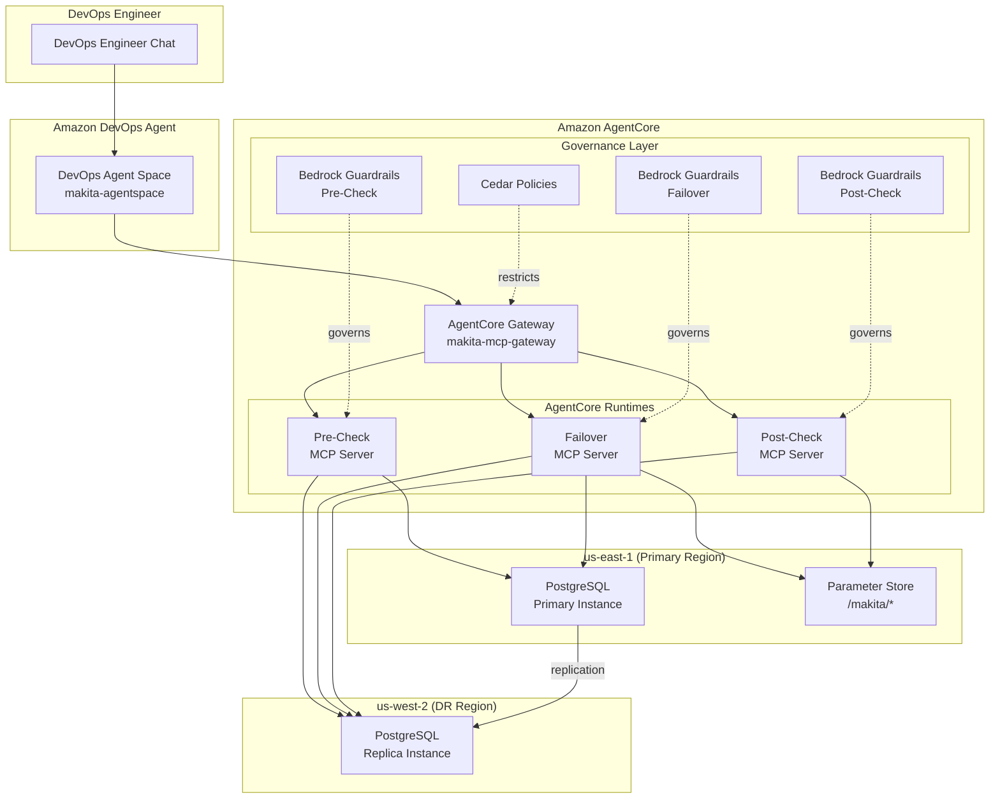

# MAKITA — Machine Augmented Key Infrastructure Technology Automation

> [!CAUTION]
> Please note that this is a work in progress, and not ready for usage.

MAKITA is a technical reference architecture demonstrating AI-assisted disaster recovery using **Amazon DevOps Agent** and **Amazon AgentCore**. The system provisions a multi-region PostgreSQL cluster across us-east-1 (primary) and us-west-2 (DR) and orchestrates automated failover through MCP servers built with the **Strands Agents SDK**.

## Key Technologies

- **Strands Agents SDK** — MCP server implementation framework
- **Amazon AgentCore** — managed hosting for MCP servers with Gateway and Cedar policies
- **Amazon DevOps Agent** — AI-assisted operations via natural language
- **Amazon Bedrock Guardrails** — safety and compliance controls for AI operations
- **AWS CDK (Python)** — infrastructure-as-code (primary)
- **AWS CloudFormation** — infrastructure-as-code (YAML templates)
- **Amazon RDS PostgreSQL** — multi-region database cluster
- **AWS Systems Manager Parameter Store** — centralized configuration

## DR Scenario

A DevOps engineer initiates a PostgreSQL disaster recovery failover through natural language chat with Amazon DevOps Agent. The agent orchestrates a three-phase sequence — pre-checks, failover execution, and post-checks — across dedicated MCP servers hosted behind an AgentCore Gateway.

## Architecture



## Project Structure

```
makita/
├── infra-cdk/                     # CDK Python infrastructure
│   ├── app.py                     # CDK app entry point
│   ├── config.py                  # Shared configuration constants
│   ├── cdk.json                   # CDK configuration
│   ├── requirements.txt           # CDK Python dependencies
│   ├── stacks/                    # CDK stack definitions
│   │   ├── postgresql_stack.py    # Primary PostgreSQL + IAM + SSM (us-east-1)
│   │   ├── postgresql_replica_stack.py  # Cross-region replica (us-west-2)
│   │   ├── agentcore_stack.py     # AgentCore runtimes, gateway, guardrails
│   │   └── devops_agent_stack.py  # DevOps Agent Space + operator role
│   ├── resources/                 # CDK construct modules
│   │   ├── postgresql.py          # VPC, RDS, IAM, SSM constructs
│   │   ├── agentcore.py           # Runtime, gateway, guardrail constructs
│   │   └── devops_agent.py        # Agent space, operator role constructs
│   └── tests/                     # Infrastructure tests
├── mcp-servers/                   # MCP server implementations
│   └── workloads/postgresql/      # PostgreSQL DR workload servers
│       ├── failover/server.py
│       ├── precheck/server.py
│       └── postcheck/server.py
├── orchestrator/                  # Failover sequence orchestration
│   ├── agent_config.py            # DevOps Agent MCP server connections
│   ├── failover_sequence.py       # Three-phase failover orchestrator
│   └── event_integration.py       # Event logging integration
├── policies/                      # Governance configurations
│   ├── agentcore/                 # Cedar policies for gateway targets
│   ├── guardrails/                # Bedrock Guardrail JSON configs
│   └── iam/                       # Generated IAM policy JSON
├── scripts/
│   ├── generate_iam_policy.py     # Generate IAM policy for AgentCore runtimes
│   └── build_skill_zip.py         # Build DevOps Agent skill zip
├── dist/                          # Build artifacts (skill zip)
├── event-logs/                    # Markdown event log files
├── tests/                         # Application tests
├── Makefile                       # Build, deploy, test commands
├── pyproject.toml
└── .gitignore
```

## Getting Started

### Prerequisites

- Python 3.11+
- Node.js 18+ (for AWS CDK)
- AWS CLI configured with credentials for us-east-1 and us-west-2
- AWS CDK v2 (`npm install -g aws-cdk`)
- AgentCore CLI (`npm install -g @aws/agentcore`)
- AWS account with permissions for RDS, SSM, IAM, CloudWatch, CloudFormation, AgentCore, and Bedrock

### Setup

1. Clone the repository:

   ```bash
   git clone -b makita https://github.com/aws-samples/sample-support-data-analysis-with-bedrock.git
   cd sample-support-data-analysis-with-bedrock/makita
   ```

2. Install dependencies:

   ```bash
   make install
   ```

3. Run tests:

   ```bash
   make test
   ```

## Deployment

### CDK Deployment (recommended)

```bash
make deploy              # Generate policies, build skill zip, deploy all stacks
make deploy-mcp-servers  # Deploy MCP servers to AgentCore Runtime
make attach-runtime-permissions  # Attach RDS/SSM permissions to runtime roles
```

Individual targets:

| Command | Description |
|---|---|
| `make generate-iam-policy` | Generate `policies/iam/agentcore-runtime-policy.json` |
| `make build-skill-zip` | Build `dist/makita-postgresql-dr-skill.zip` |
| `make deploy-primary` | Deploy Makita nested stack (PostgreSQL + AgentCore + DevOps Agent) to us-east-1 |
| `make deploy-replica` | Deploy cross-region PostgreSQL replica to us-west-2 |
| `make deploy-mcp-servers` | Deploy MCP servers to AgentCore Runtime via `agentcore` CLI |
| `make attach-runtime-permissions` | Attach RDS/SSM IAM permissions to AgentCore runtime roles |
| `make synth` | Synthesize CDK templates (no deploy) |
| `make diff` | Show pending changes |
| `make destroy` | Tear down all stacks (reverse order) |
| `make clean` | Remove .venv, cdk.out, __pycache__ |

### Registering AgentCore Gateway with DevOps Agent (Manual Step)

After `make deploy` completes, you must manually register the MCP server
and upload the skill in the DevOps Agent Operator Web App. The Agent Space
(`makita-agentspace`) was created by the CDK deploy. This is a one-time setup.

1. **Get the Gateway endpoint URL**:

   ```bash
   # Get the Gateway ID
   GATEWAY_ID=$(aws bedrock-agentcore-control list-gateways --region us-east-1 \
     --query "items[?name=='makita-mcp-gateway'].gatewayId" --output text)

   # Get the Gateway endpoint URL
   aws bedrock-agentcore-control get-gateway --region us-east-1 \
     --gateway-identifier $GATEWAY_ID \
     --query "gatewayUrl" --output text
   ```

   This returns a URL like:
   `https://makita-mcp-gateway-xxx.gateway.bedrock-agentcore.us-east-1.amazonaws.com/mcp`

2. **Get the OAuth Client Credentials**:

   ```bash
   # Client ID
   aws cloudformation list-exports --region us-east-1 \
     --query "Exports[?Name=='makita-CognitoClientId'].Value" --output text

   # Client Secret
   CLIENT_ID=$(aws cloudformation list-exports --region us-east-1 \
     --query "Exports[?Name=='makita-CognitoClientId'].Value" --output text)
   POOL_ID=$(aws cognito-idp list-user-pools --max-results 10 --region us-east-1 \
     --query "UserPools[?Name=='makita-m2m-pool'].Id" --output text)
   aws cognito-idp describe-user-pool-client --region us-east-1 \
     --user-pool-id $POOL_ID --client-id $CLIENT_ID \
     --query "UserPoolClient.ClientSecret" --output text

   # Exchange URL (token endpoint)
   aws cloudformation list-exports --region us-east-1 \
     --query "Exports[?Name=='makita-CognitoTokenEndpoint'].Value" --output text
   ```

3. **Open the DevOps Agent console** and navigate to the `makita-agentspace` space:

   https://us-east-1.console.aws.amazon.com/devops-agent/home?region=us-east-1

4. **Register the MCP server** — Go to **Capabilities** → **MCP Servers** → **Add** → **Register**:
   - **Name**: `makita-pg`
   - **Endpoint URL**: the gateway URL from step 1
   - **Description**: `MAKITA PostgreSQL DR failover via AgentCore Gateway`
   - **Authorization Flow**: OAuth Client Credentials
   - **Client ID**: from step 2
   - **Client Secret**: from step 2
   - **Exchange URL**: from step 2
   - **Scope**: `makita-mcp/invoke`
   - Leave **Enable Dynamic Client Registration** unchecked
   - Leave **Connect to endpoint using a private connection** unchecked

5. **Allowlist tools** — After registration, allowlist the 8 tools:
   - `execute_failover`, `health_check`
   - `verify_replication_health`, `verify_primary_status`, `verify_replica_readiness`
   - `verify_new_primary_health`, `verify_endpoints`, `verify_replication_established`

5. **Upload the skill** — Go to **Skills** → **Add Skill** → **Upload Skill**:
   - Upload `dist/makita-postgresql-dr-skill.zip`
   - Select agent types: Generic

6. **Verify** by asking the agent:

   ```
   What tools do you have available for PostgreSQL disaster recovery?
   ```

   The agent should list the 8 tools across the 3 MCP servers.

### What Gets Provisioned

| Resource | Identifier | Stack | Region |
|---|---|---|---|
| PostgreSQL Primary | `makita-pg-primary` | Makita | us-east-1 |
| PostgreSQL Replica | `makita-pg-replica` | MakitaPostgresqlReplica | us-west-2 |
| Parameter Store | `/makita/db/*`, `/makita/mcp/*` | Makita | us-east-1 |
| IAM Roles | `makita-failover-role`, `makita-precheck-role`, `makita-postcheck-role` | Makita | us-east-1 |
| Secrets Manager | `makita-db-master-secret` | Makita | us-east-1 |
| AgentCore Runtimes | 3 runtimes (failover, precheck, postcheck) | Makita | us-east-1 |
| AgentCore Gateway | `makita-mcp-gateway` | Makita | us-east-1 |
| Bedrock Guardrails | 3 guardrails (failover, precheck, postcheck) | Makita | us-east-1 |
| DevOps Agent Space | `makita-agentspace` | Makita | us-east-1 |
| Operator IAM Role | `makita-devops-agent-operator-role` | Makita | us-east-1 |
| CloudWatch Logs | `/makita/devops-agent` | Makita | us-east-1 |

All resources are tagged with `proj=makita`, `Env=prod1`, `auto-delete=no`.

## Initiating a Failover via DevOps Agent

In the DevOps Agent chat, request a failover:

```
Initiate a disaster recovery failover for the makita-pg-cluster
from us-east-1 to us-west-2.
```

The agent executes:

1. **Pre-Checks** — replication health, primary status, replica readiness
2. **Failover** — promote replica, update Parameter Store endpoints
3. **Post-Checks** — new primary health, endpoint verification, replication established

Pre-check failures halt the sequence. Post-check failures are reported as warnings.

## MCP Servers

| Server | Tools | Cedar Policy | Guardrail |
|---|---|---|---|
| `makita-postgresql-failover-mcp` | `execute_failover`, `health_check` | `postgresql-failover.cedar` | `postgresql-failover-guardrail.json` |
| `makita-postgresql-precheck-mcp` | `verify_replication_health`, `verify_primary_status`, `verify_replica_readiness` | `postgresql-precheck.cedar` | `postgresql-precheck-guardrail.json` |
| `makita-postgresql-postcheck-mcp` | `verify_new_primary_health`, `verify_endpoints`, `verify_replication_established` | `postgresql-postcheck.cedar` | `postgresql-postcheck-guardrail.json` |

## Running Tests

```bash
make test                          # All tests (app + infra)
.venv/bin/python -m pytest tests/ -v           # App tests only
.venv/bin/python -m pytest infra-cdk/tests/ -v # Infra tests only
```

## License

This project is a technical reference architecture for demonstration purposes.
