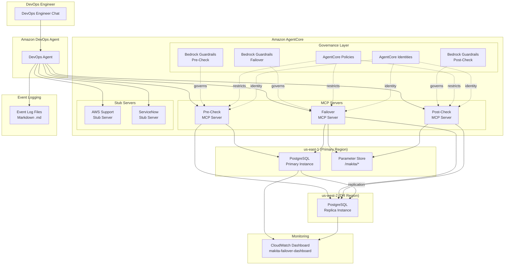

# MAKITA — Machine Augmented Key Infrastructure Technology Automation

MAKITA is a technical reference architecture demonstrating AI-assisted disaster recovery using **Amazon DevOps Agent** and **Amazon AgentCore**. The system provisions a multi-region PostgreSQL cluster across us-east-1 (primary) and us-west-2 (DR) via a single AWS CloudFormation stack and orchestrates automated failover through MCP servers built with the **Strands Agents SDK**.

## Key Technologies

- **Strands Agents SDK** — MCP server implementation framework
- **Amazon AgentCore** — managed hosting for MCP servers with governance
- **Amazon Bedrock Guardrails** — safety and compliance controls for AI operations
- **AWS CloudFormation** — infrastructure-as-code (single stack)
- **Amazon RDS PostgreSQL** — multi-region database cluster
- **AWS Systems Manager Parameter Store** — centralized configuration
- **Amazon CloudWatch** — failover monitoring dashboard

## DR Scenario

A DevOps engineer initiates a PostgreSQL disaster recovery failover through natural language chat with Amazon DevOps Agent. The agent orchestrates a three-phase sequence — pre-checks, failover execution, and post-checks — across dedicated MCP servers, while tracking the operation in both AWS Support and ServiceNow ticketing systems and logging events to markdown files.

## Architecture



## Project Structure

```
makita/
├── infrastructure/
│   └── makita-stack.yaml          # Single CloudFormation template
├── mcp-servers/
│   ├── failover/                  # Failover MCP Server (Strands SDK)
│   │   ├── models.py
│   │   └── server.py
│   ├── precheck/                  # Pre-Check MCP Server (Strands SDK)
│   │   ├── models.py
│   │   └── server.py
│   ├── postcheck/                 # Post-Check MCP Server (Strands SDK)
│   │   ├── models.py
│   │   └── server.py
│   ├── aws-support-stub/          # AWS Support Stub Server
│   │   └── server.py
│   └── servicenow-stub/           # ServiceNow Stub Server
│       └── server.py
├── orchestrator/                  # Failover sequence orchestration
│   ├── agent_config.py
│   ├── event_integration.py
│   ├── failover_sequence.py
│   └── ticketing.py
├── event-logs/                    # Markdown event log files
│   └── event_logger.py
├── tests/                         # Unit and property-based tests
├── pyproject.toml
└── README.md
```

## Getting Started

### Prerequisites

- Python 3.11+
- AWS CLI configured with credentials for us-east-1 and us-west-2
- AWS account with permissions for RDS, SSM, IAM, CloudWatch, CloudFormation, AgentCore, and Bedrock
- Amazon DevOps Agent access
- Amazon AgentCore access

### Setup

1. Clone the repository:

   ```bash
   git clone <repository-url>
   cd makita
   ```

2. Create a virtual environment and install dependencies:

   ```bash
   python -m venv .venv
   source .venv/bin/activate
   pip install -e ".[dev]"
   ```

3. Verify the installation:

   ```bash
   pytest tests/ -v
   ```

## CloudFormation Deployment

All MAKITA infrastructure is defined in a single CloudFormation template at `infrastructure/makita-stack.yaml`. This template provisions every resource as one atomic unit.

### Deploy the Stack

```bash
aws cloudformation deploy \
  --template-file infrastructure/makita-stack.yaml \
  --stack-name makita-stack \
  --capabilities CAPABILITY_NAMED_IAM \
  --region us-east-1 \
  --parameter-overrides \
    DBMasterUsername=makitaadmin \
    DBMasterUserPassword=<your-secure-password>
```

### Verify Deployment

```bash
# Check stack status
aws cloudformation describe-stacks --stack-name makita-stack --region us-east-1

# Verify outputs (primary endpoint, replica endpoint, dashboard URL)
aws cloudformation describe-stacks \
  --stack-name makita-stack \
  --region us-east-1 \
  --query "Stacks[0].Outputs"
```

### What Gets Provisioned

The single stack creates all resources with the `makita-` prefix and mandatory tags (`auto-delete=no`, `Env=prod1`):

| Resource Group | Resources |
|---|---|
| PostgreSQL Cluster | `makita-pg-primary` (us-east-1), `makita-pg-replica` (us-west-2) |
| Parameter Store | `/makita/db/*`, `/makita/mcp/*`, `/makita/dashboard/*` |
| MCP Servers | `makita-failover-mcp`, `makita-precheck-mcp`, `makita-postcheck-mcp` |
| Stub Servers | `makita-aws-support-stub`, `makita-servicenow-stub` |
| AgentCore Governance | Policies, identities, and Bedrock Guardrails per MCP server |
| CloudWatch | `makita-failover-dashboard` |
| IAM | `makita-failover-role`, `makita-precheck-role`, `makita-postcheck-role` |

### Tear Down

```bash
aws cloudformation delete-stack --stack-name makita-stack --region us-east-1
```

## MCP Server Configuration

MAKITA uses three dedicated MCP servers, each hosted in Amazon AgentCore and governed by its own AgentCore Policy, Identity, and Bedrock Guardrail.

### Failover MCP Server (`makita-failover-mcp`)

Executes the core PostgreSQL failover operation: verifies replication, promotes the replica, and updates Parameter Store endpoints.

**Tools:**
- `execute_failover(primary_region, dr_region, cluster_name)` — promotes the DR replica to primary
- `health_check(cluster_name)` — returns cluster health status

**Governance:**
- AgentCore Policy: `makita-failover-policy` — restricts to `makita-*` resources with `Env=prod1` tag
- AgentCore Identity: `makita-failover-identity` → `makita-failover-role`
- Bedrock Guardrail: `makita-failover-guardrail` — restricts to DR failover actions, blocks prompt injection

### Pre-Check MCP Server (`makita-precheck-mcp`)

Performs all pre-failover verifications before the failover is initiated.

**Tools:**
- `verify_replication_health(cluster_name)` — checks replication lag and state
- `verify_primary_status(cluster_name, primary_region)` — verifies primary instance status
- `verify_replica_readiness(cluster_name, dr_region)` — verifies replica is ready for promotion

**Governance:**
- AgentCore Policy: `makita-precheck-policy` — read-only on `makita-*` resources with `Env=prod1` tag
- AgentCore Identity: `makita-precheck-identity` → `makita-precheck-role`
- Bedrock Guardrail: `makita-precheck-guardrail` — restricts to pre-check read actions

### Post-Check MCP Server (`makita-postcheck-mcp`)

Performs all post-failover verifications after the failover completes.

**Tools:**
- `verify_new_primary_health(cluster_name, dr_region)` — verifies promoted instance health
- `verify_endpoints(cluster_name)` — verifies Parameter Store endpoints reflect the new primary
- `verify_replication_established(cluster_name)` — verifies replication from the new primary

**Governance:**
- AgentCore Policy: `makita-postcheck-policy` — read-only on `makita-*` resources with `Env=prod1` tag
- AgentCore Identity: `makita-postcheck-identity` → `makita-postcheck-role`
- Bedrock Guardrail: `makita-postcheck-guardrail` — restricts to post-check read actions

## Initiating a Failover via DevOps Agent

The failover is initiated through natural language chat with Amazon DevOps Agent. The agent connects to all five MCP servers and orchestrates the full failover sequence.

### Start a Failover

In the DevOps Agent chat, request a failover:

```
Initiate a disaster recovery failover for the makita-pg-cluster
from us-east-1 to us-west-2.
```

### Failover Sequence

DevOps Agent executes the following ordered phases:

1. **Ticket Creation** — Creates an AWS Support case and a ServiceNow ticket to track the operation
2. **Pre-Checks** (via Pre-Check MCP Server)
   - Verify replication health between primary and replica
   - Verify primary instance status in us-east-1
   - Verify replica readiness for promotion in us-west-2
3. **Failover Execution** (via Failover MCP Server)
   - Verify replication status
   - Promote replica to primary in us-west-2
   - Update Parameter Store endpoints (`/makita/db/primary-endpoint`, `/makita/db/replica-endpoint`)
4. **Post-Checks** (via Post-Check MCP Server)
   - Verify new primary health in us-west-2
   - Verify Parameter Store endpoints reflect the new primary
   - Verify replication from the new primary is established
5. **Ticket Updates** — Both tickets are updated at each phase transition with contextual details

If any pre-check fails, the failover halts. If the failover execution fails, post-checks are skipped. Each step is displayed in the DevOps Agent chat as it happens.

## Monitoring via CloudWatch Dashboard

The `makita-failover-dashboard` CloudWatch dashboard visualizes the PostgreSQL cluster failover across both regions.

### Access the Dashboard

```bash
# Get the dashboard URL from stack outputs
aws cloudformation describe-stacks \
  --stack-name makita-stack \
  --region us-east-1 \
  --query "Stacks[0].Outputs[?OutputKey=='DashboardUrl'].OutputValue" \
  --output text
```

Or navigate directly to:
```
https://console.aws.amazon.com/cloudwatch/home?region=us-east-1#dashboards:name=makita-failover-dashboard
```

### Dashboard Widgets

| Widget | Description |
|---|---|
| Primary (us-east-1) — CPU | CPU utilization of `makita-pg-primary` |
| Replica (us-west-2) — CPU | CPU utilization of `makita-pg-replica` |
| Replication Lag | Replication lag from `makita-pg-replica` |
| DB Connections | Active connections for both instances |
| Read/Write IOPS | I/O operations for both instances |
| Instance Status | Availability status for both regions |

During a failover, the dashboard reflects the change in primary and replica roles and shows replication status between regions.

## Reviewing Event Logs and Ticket Records

### Event Log Files

Each AWS Support case and ServiceNow ticket generates a corresponding markdown event log file in the `event-logs/` directory.

**File naming:** `event-log-{case_id_or_ticket_id}.md`

**Example:** `event-logs/event-log-makita-case-20240101-001.md`

Each file contains timestamped entries in the following format:

```markdown
# Event Log: makita-case-20240101-001

## Events

- **2024-01-01T12:00:00Z** — AWS Support case makita-case-20240101-001 created
- **2024-01-01T12:01:00Z** — Pre-checks initiated
- **2024-01-01T12:02:00Z** — Replication health verified: lag 0s, state streaming
- **2024-01-01T12:03:00Z** — Failover initiated on makita-pg-cluster
- **2024-01-01T12:04:00Z** — Replica promoted to primary in us-west-2
- **2024-01-01T12:05:00Z** — Endpoints updated in Parameter Store
- **2024-01-01T12:06:00Z** — Post-checks passed, failover complete
```

### Reviewing Logs

```bash
# List all event log files
ls event-logs/event-log-*.md

# View a specific event log
cat event-logs/event-log-makita-case-20240101-001.md
```

### AWS Support Cases (Stub)

The AWS Support Stub Server stores cases in-memory during the session. Cases are created with IDs in the format `makita-case-{date}-{seq}` and updated at each phase of the failover sequence.

### ServiceNow Tickets (Stub)

The ServiceNow Stub Server stores tickets in-memory during the session. Tickets are created with IDs in the format `INC{seq:07d}` and updated at each phase of the failover sequence.

Both stub servers track the full lifecycle of the DR operation, including status transitions, contextual details (resource names, regions, endpoints, MCP server involved), and any error states.

## Running Tests

```bash
# Run all tests
pytest tests/ -v

# Run a specific test file
pytest tests/test_failover_sequence.py -v
```

## License

This project is a technical reference architecture for demonstration purposes.
