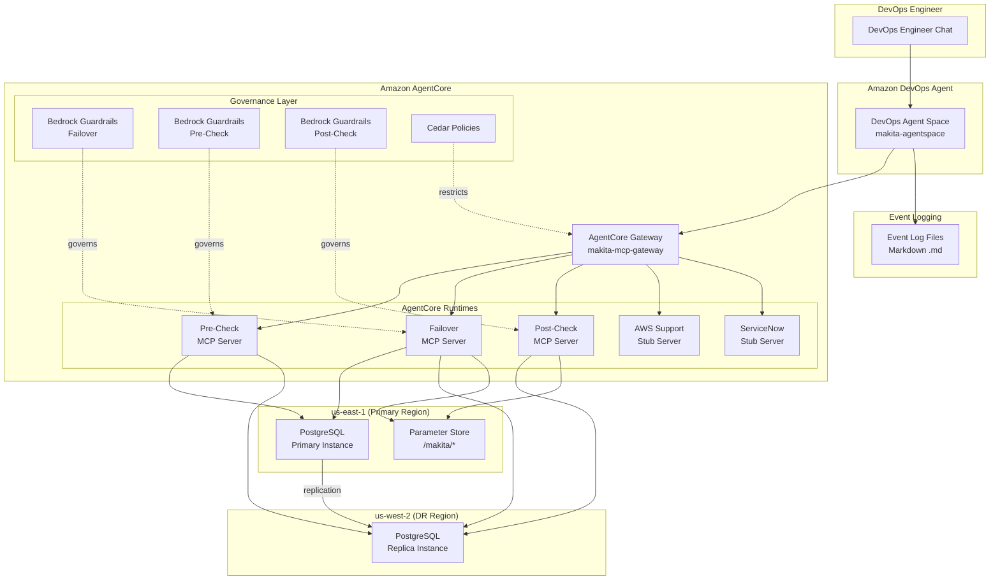

# MAKITA — Machine Augmented Key Infrastructure Technology Automation

> [!CAUTION]
> Please note that this is a work in progress, and not ready for usage.

MAKITA is a technical reference architecture demonstrating AI-assisted disaster recovery using **Amazon DevOps Agent** and **Amazon AgentCore**. The system provisions a multi-region PostgreSQL cluster across us-east-1 (primary) and us-west-2 (DR) via a single AWS CloudFormation stack and orchestrates automated failover through MCP servers built with the **Strands Agents SDK**.

## Key Technologies

- **Strands Agents SDK** — MCP server implementation framework
- **Amazon AgentCore** — managed hosting for MCP servers with Gateway and Cedar policies
- **Amazon DevOps Agent** — AI-assisted operations via natural language
- **Amazon Bedrock Guardrails** — safety and compliance controls for AI operations
- **AWS CloudFormation** — infrastructure-as-code
- **Amazon RDS PostgreSQL** — multi-region database cluster
- **AWS Systems Manager Parameter Store** — centralized configuration

## DR Scenario

A DevOps engineer initiates a PostgreSQL disaster recovery failover through natural language chat with Amazon DevOps Agent. The agent orchestrates a three-phase sequence — pre-checks, failover execution, and post-checks — across dedicated MCP servers, while tracking the operation in both AWS Support and ServiceNow ticketing systems and logging events to markdown files.

## Architecture



## Project Structure

```
makita/
├── infrastructure/
│   └── workloads/
│       └── postgresql/
│           ├── makita-postgresql-stack.yaml          # Primary stack (us-east-1)
│           └── makita-postgresql-replica-stack.yaml  # Replica stack (us-west-2)
├── scripts/
│   ├── deploy.sh                  # Automated deployment script
│   ├── deploy_agentcore.py        # AgentCore Runtime + Gateway deployment
│   ├── deploy_devops_agent.py     # DevOps Agent Space deployment
│   ├── deploy_kiro_agent.py       # Kiro agent config for AgentCore Gateway
│   └── teardown.sh                # Automated teardown script
├── mcp-servers/
│   ├── workloads/                  # Workload MCP servers
│   │   └── postgresql/            # PostgreSQL DR workload
│   │       ├── failover/          # Failover MCP Server (Strands SDK)
│   │       │   ├── models.py
│   │       │   └── server.py
│   │       ├── precheck/          # Pre-Check MCP Server (Strands SDK)
│   │       │   ├── models.py
│   │       │   └── server.py
│   │       └── postcheck/         # Post-Check MCP Server (Strands SDK)
│   │           ├── models.py
│   │           └── server.py
│   ├── aws-support-stub/          # AWS Support Stub Server
│   │   └── server.py
│   ├── servicenow-stub/           # ServiceNow Stub Server
│   │   └── server.py
│   └── agentcore_gateway_proxy.py # Gateway proxy for Kiro agent
├── policies/                      # AgentCore and Bedrock governance configs
│   ├── agentcore/                 # Cedar policies for AgentCore Gateway targets
│   │   ├── postgresql-failover.cedar
│   │   ├── postgresql-precheck.cedar
│   │   ├── postgresql-postcheck.cedar
│   │   ├── aws-support-stub.cedar
│   │   └── servicenow-stub.cedar
│   └── guardrails/                # Bedrock Guardrail configurations
│       ├── postgresql-failover-guardrail.json
│       ├── postgresql-precheck-guardrail.json
│       ├── postgresql-postcheck-guardrail.json
│       ├── aws-support-stub-guardrail.json
│       └── servicenow-stub-guardrail.json
├── orchestrator/                  # Failover sequence orchestration
│   ├── agent_config.py
│   ├── event_integration.py
│   ├── failover_sequence.py
│   └── ticketing.py
├── event-logs/                    # Markdown event log files
│   └── event_logger.py
├── tests/                         # Unit and property-based tests
├── pyproject.toml
└── README.md
```

## Getting Started

### Prerequisites

- Python 3.11+
- AWS CLI configured with credentials for us-east-1 and us-west-2
- AWS account with permissions for RDS, SSM, IAM, CloudWatch, CloudFormation, AgentCore, and Bedrock
- Amazon DevOps Agent access
- Amazon AgentCore access

### Setup

1. Clone the repository:

   ```bash
   git clone <repository-url>
   cd makita
   ```

  WIP to get the working branch. Use this command until this work is merged with main.
  ```bash
  git clone -b makita https://github.com/aws-samples/sample-support-data-analysis-with-bedrock.git
  ```

2. Create a virtual environment and install dependencies:

   ```bash
   python -m venv .venv
   source .venv/bin/activate
   pip install -e ".[dev]"
   ```

3. Verify the installation:

   ```bash
   pytest tests/ -v
   ```

4. Deploy the infrastructure:

   ```bash
   ./scripts/deploy.sh
   ```

   This script deploys both CloudFormation stacks in order (primary to us-east-1, replica to us-west-2) and wires them together. See [CloudFormation Deployment](#cloudformation-deployment) for details.

## CloudFormation Deployment

All MAKITA infrastructure is defined in two CloudFormation templates: a primary stack deployed to us-east-1 and a replica stack deployed to us-west-2.

### Automated Deployment (recommended)

```bash
./scripts/deploy.sh            # Deploy everything (default)
```

The script supports targeted deployments:

| Target | Command | Description |
|---|---|---|
| `postgresql` | `./scripts/deploy.sh postgresql` | Deploy PostgreSQL primary stack to us-east-1 |
| `postgresql-dr` | `./scripts/deploy.sh postgresql-dr` | Deploy PostgreSQL replica stack to us-west-2 and update primary with replica endpoint |
| `agentcore` | `./scripts/deploy.sh agentcore` | Deploy AgentCore Runtimes, Gateway, Cedar policies, and Bedrock Guardrails to us-east-1 |
| `devops-agent` | `./scripts/deploy.sh devops-agent` | Deploy DevOps Agent Space, operator IAM role, and web app to us-east-1 |
| `kiro-agent` | `./scripts/deploy.sh kiro-agent` | Deploy Kiro agent config for AgentCore Gateway |
| `all` | `./scripts/deploy.sh all` | Deploy all targets in order (default when no argument given) |

When run with `all` (or no argument), the script executes in order:
1. Deploys `makita-postgresql-stack` to us-east-1 (primary RDS, SSM, IAM, Guardrails)
2. Deploys `makita-postgresql-replica-stack` to us-west-2 (cross-region read replica) and updates primary with replica endpoint
3. Deploys AgentCore Runtimes + Gateway with Cedar policies and Bedrock Guardrails
4. Deploys DevOps Agent Space with operator role and web app

On completion it prints the primary endpoint, replica endpoint, and dashboard URL.

### Manual Deployment (step-by-step)

### Step 1 — Deploy the Primary Stack (us-east-1)

```bash
aws cloudformation deploy \
  --template-file infrastructure/workloads/postgresql/makita-postgresql-stack.yaml \
  --stack-name makita-postgresql-stack \
  --capabilities CAPABILITY_NAMED_IAM \
  --region us-east-1
```

### Step 2 — Get the Primary Instance ARN

```bash
PRIMARY_ARN=$(aws cloudformation describe-stacks \
  --stack-name makita-postgresql-stack \
  --region us-east-1 \
  --query "Stacks[0].Outputs[?OutputKey=='PrimaryInstanceArn'].OutputValue" \
  --output text)
```

### Step 3 — Deploy the Replica Stack (us-west-2)

```bash
aws cloudformation deploy \
  --template-file infrastructure/workloads/postgresql/makita-postgresql-replica-stack.yaml \
  --stack-name makita-postgresql-replica-stack \
  --region us-west-2 \
  --parameter-overrides PrimaryInstanceArn=$PRIMARY_ARN
```

### Step 4 — Update the Primary Stack with the Replica Endpoint

```bash
REPLICA_ENDPOINT=$(aws cloudformation describe-stacks \
  --stack-name makita-postgresql-replica-stack \
  --region us-west-2 \
  --query "Stacks[0].Outputs[?OutputKey=='ReplicaEndpoint'].OutputValue" \
  --output text)

aws cloudformation deploy \
  --template-file infrastructure/workloads/postgresql/makita-postgresql-stack.yaml \
  --stack-name makita-postgresql-stack \
  --capabilities CAPABILITY_NAMED_IAM \
  --region us-east-1 \
  --parameter-overrides ReplicaEndpoint=$REPLICA_ENDPOINT
```

### Verify Deployment

```bash
# Check primary stack status
aws cloudformation describe-stacks --stack-name makita-postgresql-stack --region us-east-1

# Check replica stack status
aws cloudformation describe-stacks --stack-name makita-postgresql-replica-stack --region us-west-2

# Verify outputs
aws cloudformation describe-stacks \
  --stack-name makita-postgresql-stack \
  --region us-east-1 \
  --query "Stacks[0].Outputs"
```

### What Gets Provisioned

Resources are deployed across CloudFormation stacks and AgentCore scripts, all with the `makita-` prefix and mandatory tags (`auto-delete=no`, `Env=prod1`):

| Resource Group | Resources | Deployed By |
|---|---|---|
| PostgreSQL Primary | `makita-pg-primary` | `makita-postgresql-stack` (CFN) / us-east-1 |
| PostgreSQL Replica | `makita-pg-replica` | `makita-postgresql-replica-stack` (CFN) / us-west-2 |
| Parameter Store | `/makita/db/*` | `makita-postgresql-stack` (CFN) / us-east-1 |
| IAM Roles | `makita-failover-role`, `makita-precheck-role`, `makita-postcheck-role` | `makita-postgresql-stack` (CFN) / us-east-1 |
| Secrets Manager | `makita-db-master-secret` | `makita-postgresql-stack` (CFN) / us-east-1 |
| Bedrock Guardrails | `makita-failover-guardrail`, `makita-precheck-guardrail`, `makita-postcheck-guardrail` | `makita-postgresql-stack` (CFN) / us-east-1 |
| AgentCore Runtimes | 5 runtimes (failover, precheck, postcheck, aws-support, servicenow) | `deploy_agentcore.py` / us-east-1 |
| AgentCore Gateway | `makita-mcp-gateway` with Cedar policies per target | `deploy_agentcore.py` / us-east-1 |
| Bedrock Guardrails | Per-runtime guardrails from `policies/guardrails/` | `deploy_agentcore.py` / us-east-1 |
| DevOps Agent Space | `makita-agentspace` with operator role and web app | `deploy_devops_agent.py` / us-east-1 |

### Tear Down

```bash
./scripts/teardown.sh
```

Or manually:

```bash
# Delete replica stack first (us-west-2)
aws cloudformation delete-stack --stack-name makita-postgresql-replica-stack --region us-west-2
aws cloudformation wait stack-delete-complete --stack-name makita-postgresql-replica-stack --region us-west-2

# Then delete primary stack (us-east-1)
aws cloudformation delete-stack --stack-name makita-postgresql-stack --region us-east-1
```

## MCP Server Configuration

MAKITA uses five MCP servers, each hosted as an AgentCore Runtime behind the `makita-mcp-gateway` AgentCore Gateway. Each gateway target has a Cedar policy (`policies/agentcore/`) restricting allowed tool actions, and a Bedrock Guardrail (`policies/guardrails/`) for content safety.

### Failover MCP Server (`makita-postgresql-failover-mcp`)

Executes the core PostgreSQL failover operation: verifies replication, promotes the replica, and updates Parameter Store endpoints.

**Tools:**
- `execute_failover(primary_region, dr_region, cluster_name)` — promotes the DR replica to primary
- `health_check(cluster_name)` — returns cluster health status

**Governance:**
- Cedar Policy: `policies/agentcore/postgresql-failover.cedar`
- Bedrock Guardrail: `policies/guardrails/postgresql-failover-guardrail.json`
- IAM Role: `makita-failover-role`

### Pre-Check MCP Server (`makita-postgresql-precheck-mcp`)

Performs all pre-failover verifications before the failover is initiated.

**Tools:**
- `verify_replication_health(cluster_name)` — checks replication lag and state
- `verify_primary_status(cluster_name, primary_region)` — verifies primary instance status
- `verify_replica_readiness(cluster_name, dr_region)` — verifies replica is ready for promotion

**Governance:**
- Cedar Policy: `policies/agentcore/postgresql-precheck.cedar`
- Bedrock Guardrail: `policies/guardrails/postgresql-precheck-guardrail.json`
- IAM Role: `makita-precheck-role`

### Post-Check MCP Server (`makita-postgresql-postcheck-mcp`)

Performs all post-failover verifications after the failover completes.

**Tools:**
- `verify_new_primary_health(cluster_name, dr_region)` — verifies promoted instance health
- `verify_endpoints(cluster_name)` — verifies Parameter Store endpoints reflect the new primary
- `verify_replication_established(cluster_name)` — verifies replication from the new primary

**Governance:**
- Cedar Policy: `policies/agentcore/postgresql-postcheck.cedar`
- Bedrock Guardrail: `policies/guardrails/postgresql-postcheck-guardrail.json`
- IAM Role: `makita-postcheck-role`

### AWS Support Stub Server (`makita-aws-support-stub`)

Simulates the AWS Support API for tracking DR operations.

**Tools:**
- `create_support_case(subject, description, ...)` — creates a support case
- `update_support_case(case_id, status, ...)` — updates a support case

**Governance:**
- Cedar Policy: `policies/agentcore/aws-support-stub.cedar`
- Bedrock Guardrail: `policies/guardrails/aws-support-stub-guardrail.json`

### ServiceNow Stub Server (`makita-servicenow-stub`)

Simulates the ServiceNow API for incident ticket tracking.

**Tools:**
- `create_ticket(short_description, description, ...)` — creates an incident ticket
- `update_ticket(ticket_id, status, ...)` — updates an incident ticket

**Governance:**
- Cedar Policy: `policies/agentcore/servicenow-stub.cedar`
- Bedrock Guardrail: `policies/guardrails/servicenow-stub-guardrail.json`

## Initiating a Failover via DevOps Agent

The failover is initiated through natural language chat with Amazon DevOps Agent. The agent connects to all five MCP servers and orchestrates the full failover sequence.

### Start a Failover

In the DevOps Agent chat, request a failover:

```
Initiate a disaster recovery failover for the makita-pg-cluster
from us-east-1 to us-west-2.
```

### Failover Sequence

DevOps Agent executes the following ordered phases:

1. **Ticket Creation** — Creates an AWS Support case and a ServiceNow ticket to track the operation
2. **Pre-Checks** (via Pre-Check MCP Server)
   - Verify replication health between primary and replica
   - Verify primary instance status in us-east-1
   - Verify replica readiness for promotion in us-west-2
3. **Failover Execution** (via Failover MCP Server)
   - Verify replication status
   - Promote replica to primary in us-west-2
   - Update Parameter Store endpoints (`/makita/db/primary-endpoint`, `/makita/db/replica-endpoint`)
4. **Post-Checks** (via Post-Check MCP Server)
   - Verify new primary health in us-west-2
   - Verify Parameter Store endpoints reflect the new primary
   - Verify replication from the new primary is established
5. **Ticket Updates** — Both tickets are updated at each phase transition with contextual details

If any pre-check fails, the failover halts. If the failover execution fails, post-checks are skipped. Each step is displayed in the DevOps Agent chat as it happens.

## Reviewing Event Logs and Ticket Records

### Event Log Files

Each AWS Support case and ServiceNow ticket generates a corresponding markdown event log file in the `event-logs/` directory.

**File naming:** `event-log-{case_id_or_ticket_id}.md`

**Example:** `event-logs/event-log-makita-case-20240101-001.md`

Each file contains timestamped entries in the following format:

```markdown
# Event Log: makita-case-20240101-001

## Events

- **2024-01-01T12:00:00Z** — AWS Support case makita-case-20240101-001 created
- **2024-01-01T12:01:00Z** — Pre-checks initiated
- **2024-01-01T12:02:00Z** — Replication health verified: lag 0s, state streaming
- **2024-01-01T12:03:00Z** — Failover initiated on makita-pg-cluster
- **2024-01-01T12:04:00Z** — Replica promoted to primary in us-west-2
- **2024-01-01T12:05:00Z** — Endpoints updated in Parameter Store
- **2024-01-01T12:06:00Z** — Post-checks passed, failover complete
```

### Reviewing Logs

```bash
# List all event log files
ls event-logs/event-log-*.md

# View a specific event log
cat event-logs/event-log-makita-case-20240101-001.md
```

### AWS Support Cases (Stub)

The AWS Support Stub Server stores cases in-memory during the session. Cases are created with IDs in the format `makita-case-{date}-{seq}` and updated at each phase of the failover sequence.

### ServiceNow Tickets (Stub)

The ServiceNow Stub Server stores tickets in-memory during the session. Tickets are created with IDs in the format `INC{seq:07d}` and updated at each phase of the failover sequence.

Both stub servers track the full lifecycle of the DR operation, including status transitions, contextual details (resource names, regions, endpoints, MCP server involved), and any error states.

## Running Tests

```bash
# Run all tests
pytest tests/ -v

# Run a specific test file
pytest tests/test_failover_sequence.py -v
```

## License

This project is a technical reference architecture for demonstration purposes.
