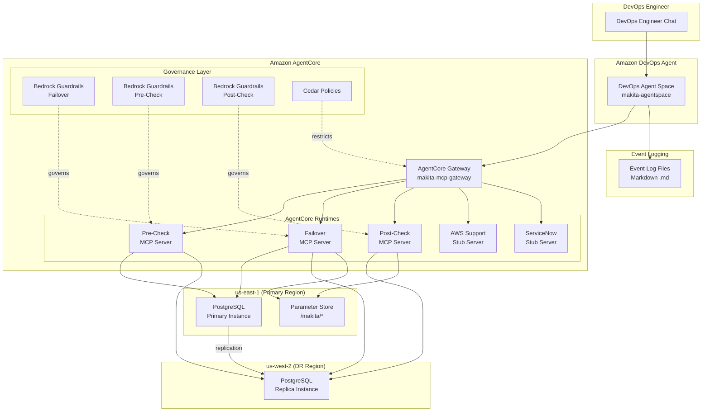

# MAKITA — Machine Augmented Key Infrastructure Technology Automation

> [!CAUTION]
> Please note that this is a work in progress, and not ready for usage.

MAKITA is a technical reference architecture demonstrating AI-assisted disaster recovery using **Amazon DevOps Agent** and **Amazon AgentCore**. The system provisions a multi-region PostgreSQL cluster across us-east-1 (primary) and us-west-2 (DR) and orchestrates automated failover through MCP servers built with the **Strands Agents SDK**.

## Key Technologies

- **Strands Agents SDK** — MCP server implementation framework
- **Amazon AgentCore** — managed hosting for MCP servers with Gateway and Cedar policies
- **Amazon DevOps Agent** — AI-assisted operations via natural language
- **Amazon Bedrock Guardrails** — safety and compliance controls for AI operations
- **AWS CDK (Python)** — infrastructure-as-code (primary)
- **AWS CloudFormation** — infrastructure-as-code (YAML templates)
- **Amazon RDS PostgreSQL** — multi-region database cluster
- **AWS Systems Manager Parameter Store** — centralized configuration

## DR Scenario

A DevOps engineer initiates a PostgreSQL disaster recovery failover through natural language chat with Amazon DevOps Agent. The agent orchestrates a three-phase sequence — pre-checks, failover execution, and post-checks — across dedicated MCP servers, while tracking the operation in both AWS Support and ServiceNow ticketing systems and logging events to markdown files.

## Architecture



## Project Structure

```
makita/
├── infra-cdk/                     # CDK Python infrastructure
│   ├── app.py                     # CDK app entry point
│   ├── config.py                  # Shared configuration constants
│   ├── cdk.json                   # CDK configuration
│   ├── requirements.txt           # CDK Python dependencies
│   ├── stacks/                    # CDK stack definitions
│   │   ├── postgresql_stack.py    # Primary PostgreSQL + IAM + SSM (us-east-1)
│   │   ├── postgresql_replica_stack.py  # Cross-region replica (us-west-2)
│   │   ├── agentcore_stack.py     # AgentCore runtimes, gateway, guardrails
│   │   └── devops_agent_stack.py  # DevOps Agent Space + operator role
│   ├── resources/                 # CDK construct modules
│   │   ├── postgresql.py          # VPC, RDS, IAM, SSM constructs
│   │   ├── agentcore.py           # Runtime, gateway, guardrail constructs
│   │   └── devops_agent.py        # Agent space, operator role constructs
│   └── tests/                     # Infrastructure tests
│       ├── test_infrastructure.py
│       ├── test_postgresql_cluster.py
│       └── test_guardrails.py
├── infra-cfn/                     # CloudFormation YAML templates
│   ├── workloads/postgresql/
│   │   ├── makita-postgresql-stack.yaml          # Primary stack (us-east-1)
│   │   └── makita-postgresql-replica-stack.yaml  # Replica stack (us-west-2)
│   ├── makita-agentcore-stack.yaml               # AgentCore resources
│   └── makita-devops-agent-stack.yaml            # DevOps Agent resources
├── orchestrator/                  # Failover sequence orchestration
│   ├── agent_config.py            # DevOps Agent MCP server connections
│   ├── failover_sequence.py       # Three-phase failover orchestrator
│   ├── event_integration.py       # Ticketing + logging integration
│   └── ticketing.py               # AWS Support + ServiceNow ticket management
├── mcp-servers/                   # MCP server implementations
│   ├── workloads/postgresql/      # PostgreSQL DR workload servers
│   │   ├── failover/server.py
│   │   ├── precheck/server.py
│   │   └── postcheck/server.py
│   ├── aws-support-stub/server.py
│   ├── servicenow-stub/server.py
│   └── agentcore_gateway_proxy.py
├── policies/                      # Governance configurations
│   ├── agentcore/                 # Cedar policies for gateway targets
│   └── guardrails/                # Bedrock Guardrail JSON configs
├── event-logs/                    # Markdown event log files
│   └── event_logger.py
├── scripts/
│   └── deploy_kiro_agent.py       # Kiro agent config for AgentCore Gateway
├── tests/                         # Application tests
├── Makefile                       # Build, deploy, test commands
├── pyproject.toml
└── .gitignore
```

## Getting Started

### Prerequisites

- Python 3.11+
- Node.js 18+ (for AWS CDK)
- Docker (required for building AgentCore MCP server container images)
- AWS CLI configured with credentials for us-east-1 and us-west-2
- AWS CDK v2 (`npm install -g aws-cdk`)
- AWS account with permissions for RDS, SSM, IAM, CloudWatch, CloudFormation, AgentCore, and Bedrock

### Setup

1. Clone the repository:

   ```bash
   git clone -b makita https://github.com/aws-samples/sample-support-data-analysis-with-bedrock.git
   cd sample-support-data-analysis-with-bedrock/makita
   ```

2. Install dependencies:

   ```bash
   make install
   ```

3. Run tests:

   ```bash
   make test
   ```

## Deployment

MAKITA provides two deployment paths: CDK Python (recommended) and CloudFormation YAML.

### CDK Deployment (recommended)

```bash
make deploy              # Deploy all 4 stacks in order
```

Individual stack targets:

| Command | Stack | Region | Description |
|---|---|---|---|
| `make deploy-postgresql` | MakitaPostgresql | us-east-1 | Primary PostgreSQL + IAM + SSM |
| `make deploy-postgresql-dr` | MakitaPostgresqlReplica | us-west-2 | Cross-region read replica |
| `make deploy-agentcore` | MakitaAgentCore | us-east-1 | AgentCore runtimes, gateway, guardrails |
| `make deploy-devops-agent` | MakitaDevOpsAgent | us-east-1 | DevOps Agent Space + operator role |
| `make deploy-kiro-agent` | — | — | Kiro agent config for AgentCore Gateway |

Other commands:

```bash
make synth               # Synthesize CDK templates (no deploy)
make diff                # Show pending changes
make destroy             # Tear down all stacks (reverse order)
make clean               # Remove .venv, cdk.out, __pycache__
make help                # Show all available targets
```

### CloudFormation Deployment (manual)

Templates are in `infra-cfn/`. Deploy in order:

```bash
# 1. Primary PostgreSQL (us-east-1)
aws cloudformation deploy \
  --template-file infra-cfn/workloads/postgresql/makita-postgresql-stack.yaml \
  --stack-name makita-postgresql-stack \
  --capabilities CAPABILITY_NAMED_IAM \
  --region us-east-1

# 2. Get primary instance ARN
PRIMARY_ARN=$(aws cloudformation describe-stacks \
  --stack-name makita-postgresql-stack --region us-east-1 \
  --query "Stacks[0].Outputs[?OutputKey=='PrimaryInstanceArn'].OutputValue" \
  --output text)

# 3. Replica (us-west-2)
aws cloudformation deploy \
  --template-file infra-cfn/workloads/postgresql/makita-postgresql-replica-stack.yaml \
  --stack-name makita-postgresql-replica-stack \
  --region us-west-2 \
  --parameter-overrides PrimaryInstanceArn=$PRIMARY_ARN

# 4. AgentCore resources
aws cloudformation deploy \
  --template-file infra-cfn/makita-agentcore-stack.yaml \
  --stack-name makita-agentcore-stack \
  --capabilities CAPABILITY_NAMED_IAM \
  --region us-east-1

# 5. DevOps Agent resources
aws cloudformation deploy \
  --template-file infra-cfn/makita-devops-agent-stack.yaml \
  --stack-name makita-devops-agent-stack \
  --capabilities CAPABILITY_NAMED_IAM \
  --region us-east-1
```

### Tear Down

```bash
make destroy             # CDK: destroys all stacks in reverse order
```

Or manually (CloudFormation):

```bash
aws cloudformation delete-stack --stack-name makita-devops-agent-stack --region us-east-1
aws cloudformation delete-stack --stack-name makita-agentcore-stack --region us-east-1
aws cloudformation delete-stack --stack-name makita-postgresql-replica-stack --region us-west-2
aws cloudformation wait stack-delete-complete --stack-name makita-postgresql-replica-stack --region us-west-2
aws cloudformation delete-stack --stack-name makita-postgresql-stack --region us-east-1
```

### What Gets Provisioned

| Resource | Identifier | Stack | Region |
|---|---|---|---|
| PostgreSQL Primary | `makita-pg-primary` | MakitaPostgresql | us-east-1 |
| PostgreSQL Replica | `makita-pg-replica` | MakitaPostgresqlReplica | us-west-2 |
| Parameter Store | `/makita/db/*`, `/makita/mcp/*` | MakitaPostgresql | us-east-1 |
| IAM Roles | `makita-failover-role`, `makita-precheck-role`, `makita-postcheck-role` | MakitaPostgresql | us-east-1 |
| Secrets Manager | `makita-db-master-secret` | MakitaPostgresql | us-east-1 |
| S3 Artifacts | `makita-artifacts-{account}` | MakitaAgentCore | us-east-1 |
| AgentCore Runtimes | 5 runtimes (failover, precheck, postcheck, support, servicenow) | MakitaAgentCore | us-east-1 |
| AgentCore Gateway | `makita-mcp-gateway` | MakitaAgentCore | us-east-1 |
| Bedrock Guardrails | 3 guardrails (failover, precheck, postcheck) | MakitaAgentCore | us-east-1 |
| DevOps Agent Space | `makita-agentspace` | MakitaDevOpsAgent | us-east-1 |
| Operator IAM Role | `makita-devops-agent-operator-role` | MakitaDevOpsAgent | us-east-1 |
| CloudWatch Logs | `/makita/devops-agent` | MakitaDevOpsAgent | us-east-1 |

All resources are tagged with `proj=makita`, `Env=prod1`, `auto-delete=no`.

## Initiating a Failover via DevOps Agent

In the DevOps Agent chat, request a failover:

```
Initiate a disaster recovery failover for the makita-pg-cluster
from us-east-1 to us-west-2.
```

The agent executes:

1. **Ticket Creation** — AWS Support case + ServiceNow ticket
2. **Pre-Checks** — replication health, primary status, replica readiness
3. **Failover** — promote replica, update Parameter Store endpoints
4. **Post-Checks** — new primary health, endpoint verification, replication established
5. **Ticket Updates** — both tickets updated at each phase transition

Pre-check failures halt the sequence. Post-check failures are reported as warnings.

## MCP Servers

| Server | Tools | Cedar Policy | Guardrail |
|---|---|---|---|
| `makita-postgresql-failover-mcp` | `execute_failover`, `health_check` | `postgresql-failover.cedar` | `postgresql-failover-guardrail.json` |
| `makita-postgresql-precheck-mcp` | `verify_replication_health`, `verify_primary_status`, `verify_replica_readiness` | `postgresql-precheck.cedar` | `postgresql-precheck-guardrail.json` |
| `makita-postgresql-postcheck-mcp` | `verify_new_primary_health`, `verify_endpoints`, `verify_replication_established` | `postgresql-postcheck.cedar` | `postgresql-postcheck-guardrail.json` |
| `makita-aws-support-stub` | `create_support_case`, `update_support_case` | `aws-support-stub.cedar` | `aws-support-stub-guardrail.json` |
| `makita-servicenow-stub` | `create_ticket`, `update_ticket` | `servicenow-stub.cedar` | `servicenow-stub-guardrail.json` |

## Running Tests

```bash
make test                          # All tests (app + infra)
.venv/bin/python -m pytest tests/ -v           # App tests only
.venv/bin/python -m pytest infra-cdk/tests/ -v # Infra tests only
```

## License

This project is a technical reference architecture for demonstration purposes.
