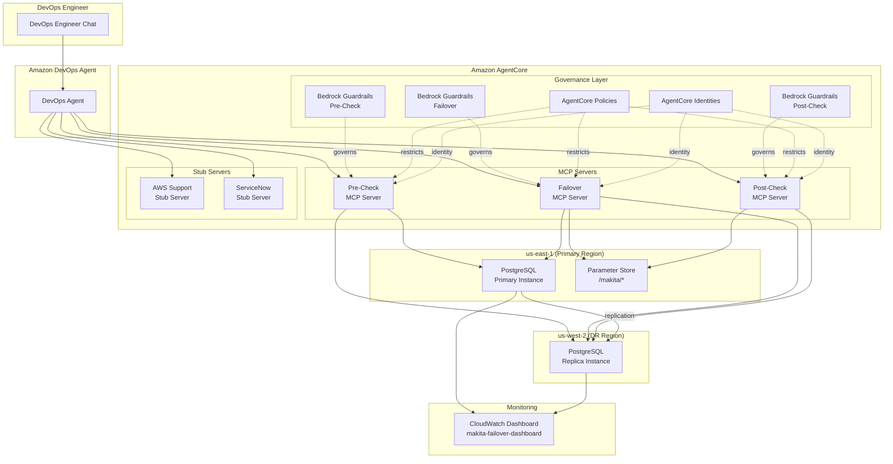

# MAKITA System Architecture

```mermaid
graph TB
    subgraph "DevOps Engineer"
        User[DevOps Engineer Chat]
    end

    subgraph "Amazon DevOps Agent"
        DA[DevOps Agent]
    end

    subgraph "Amazon AgentCore"
        subgraph "Governance Layer"
            BG_F[Bedrock Guardrails<br/>Failover]
            BG_Pre[Bedrock Guardrails<br/>Pre-Check]
            BG_Post[Bedrock Guardrails<br/>Post-Check]
            AP[AgentCore Policies]
            AI[AgentCore Identities]
        end

        subgraph "MCP Servers"
            PreMCP[Pre-Check<br/>MCP Server]
            FailMCP[Failover<br/>MCP Server]
            PostMCP[Post-Check<br/>MCP Server]
        end

        subgraph "Stub Servers"
            AWSS[AWS Support<br/>Stub Server]
            SNS[ServiceNow<br/>Stub Server]
        end
    end

    subgraph "us-east-1 (Primary Region)"
        PG_Primary[PostgreSQL<br/>Primary Instance]
        PS[Parameter Store<br/>/makita/*]
    end

    subgraph "us-west-2 (DR Region)"
        PG_Replica[PostgreSQL<br/>Replica Instance]
    end

    subgraph "Monitoring"
        CWD[CloudWatch Dashboard<br/>makita-failover-dashboard]
    end

    User --> DA
    DA --> PreMCP
    DA --> FailMCP
    DA --> PostMCP
    DA --> AWSS
    DA --> SNS

    BG_F -.->|governs| FailMCP
    BG_Pre -.->|governs| PreMCP
    BG_Post -.->|governs| PostMCP
    AP -.->|restricts| PreMCP
    AP -.->|restricts| FailMCP
    AP -.->|restricts| PostMCP
    AI -.->|identity| PreMCP
    AI -.->|identity| FailMCP
    AI -.->|identity| PostMCP

    PreMCP --> PG_Primary
    PreMCP --> PG_Replica
    FailMCP --> PG_Primary
    FailMCP --> PG_Replica
    FailMCP --> PS
    PostMCP --> PG_Replica
    PostMCP --> PS

    PG_Primary -->|replication| PG_Replica
    PG_Primary --> CWD
    PG_Replica --> CWD
```
